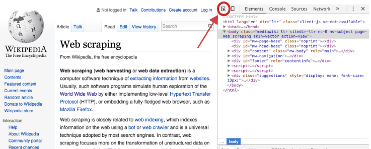
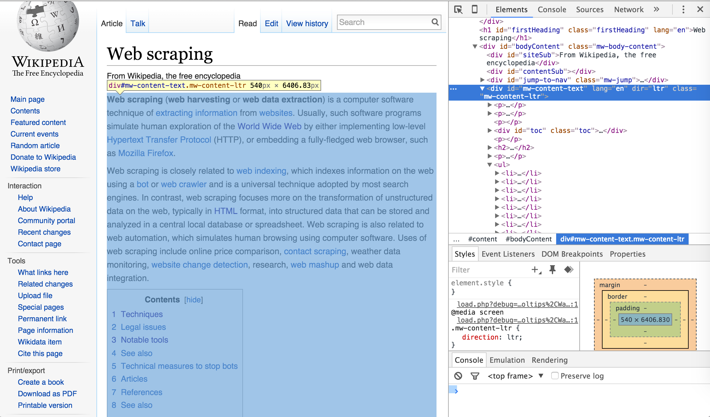

```{r setup, include=FALSE}
knitr::opts_chunk$set(echo = TRUE, eval=FALSE)
```


# Getting Started

Rapid growth of the World Wide Web has significantly changed the way we share. collect, and publish data. Vast amount of information is being stored online, both in structured (i.e., in tables) and unstructured forms. In this lab, we will work to collect data from the web using R. There are two useful packages to scrape the web page: `rvest` (to harvest the content of the webpage) and `httr` (to interact with web server via the http protocol).

```{r, message=FALSE}
# You might need to install the packages if they are not available
library(rvest)
library(httr)
library(tidyverse)
```

# Downloading data files automatically

The most basic form of getting data from online is to download many tabular (i.e. .txt, .csv) or Excel files that are being hosted online. This is the simplest level of  *web scraping*; however, I think its a good place to start introducing the user to interacting with the web for obtaining data.

I have mentioned about the on-time airline data that was part of the competition in 2009. The [webpage](http://stat-computing.org/dataexpo/2009/the-data.html) provides the compressed CSV (common-separated value) files of all domestic flights in the US from 1987 to 2008. To obtain all of the files manually, one has to click on links and move the downloaded files one-by-one. Well, it is still manageable with just 22 files, but .... what if we have more than just 22 files?

To download a single file:

```{r}
download.file("http://stat-computing.org/dataexpo/2009/2008.csv.bz2", "2008.csv.bz2")
```

If you hover your pointer over all the links, you can see that they follow a fixed pattern. To download data from 2007, the URL will be

```
http://stat-computing.org/dataexpo/2009/2007.csv.bz2
```

So, the game plan is to sequentially replace the year in the URL and use the function `download.file()` to obtain the file. But how to create such string for the URL?

# Very very brief introduction to strings in R

This part briefly introduces you to string in R. We will spend more time on strings when we start learning *text analysis*.

## String basics

You can create strings with either single quotes or double quotes.
```{r}
string1 <- "This is a string"
string2 <- 'If I want to include a "quote" inside a string, I use single quotes'
```

To include a literal single or double quote in a string you can use backslash to “escape” it:

```{r}
double_quote <- "\"" # or '"'
single_quote <- '\'' # or "'"
```

That means if you want to include a literal backslash, you'll need to double it up. There are a handful of other special characters, such as newline, or tab, but you can see the complete list by requesting help on ": ?'"', or ?"'". 

Multiple strings are often stored in a character vector, which you can create with `c()`:

```{r}
c("one", "two", "three")
```

## The `stringr` package, part of the `tidyverse`

Base R contains many functions to work with strings but we'll avoid them because they can be inconsistent, which makes them hard to remember. Instead we'll use functions from `stringr`. These have more intuitive names, and all start with `str_`. For example, `str_length()` tells you the number of characters in a string:

```{r}
str_length(c("a", "R for data science", NA))
```

To combine two or more strings, use `str_c()`:

```{r}
str_c("x", "y")
str_c("x", "y", "z")
```

Use the `sep` argument to control how they're separated:

```{r}
str_c("x", "y", sep = ", ")
```

To collapse a vector of strings into a single string, use `collapse`:

```{r}
str_c(c("x", "y", "z"), collapse = ", ")
```

You can extract parts of a string using `str_sub()`. As well as the string, `str_sub()` takes `start` and `end` arguments which give the (inclusive) position of the substring:

```{r}
x <- c("Apple", "Banana", "Pear")
str_sub(x, 1, 3)

# negative numbers count backwards from end
str_sub(x, -3, -1)
```

Note that `str_sub()` won't fail if the string is too short: it will just return as much as possible:

```{r}
str_sub("a", 1, 5)
```

You can also use the assignment form of `str_sub()` to modify strings:

```{r}
str_sub(x, 1, 1) <- str_to_lower(str_sub(x, 1, 1))
x
```

Back to the example of download all the files. We will use the `for` loop 

```{r}
for (year in 1987:2008) {
  URL <- str_c("http://stat-computing.org/dataexpo/2009/", year, ".csv.bz2")
  # replace the ... with an appropriate name
  filename <- ...
  download.file(url = URL, destfile = filename)
}
```

**Question 1:** Complete the about `for` loop by replacing ... with an appropriate name.


# Scraping HTML Text

Vast amount of information exists across the interminable webpages that exist online. Much of this information are “unstructured” text that may be useful in our analyses. This section covers the basics of scraping these texts from online sources. You can see the demo codes from previous lecture to see how to scrape "structured" form (i.e., tables).

Throughout this section I will illustrate how to extract different text components of webpages by dissecting the [Wikipedia page on web scraping](https://en.wikipedia.org/wiki/Web_scraping). However, its important to first cover one of the basic components of HTML elements as we will leverage this information to pull desired information. 

HTML elements/nodes are written with a start tag, an end tag, and with the content in between: `<tagname>content</tagname>`. The tags which typically contain the textual content we wish to scrape, and the tags we will leverage in the next section, include:

- `<h1>`, `<h2>`, ... , `<h6>`: Largest heading, second largest heading, etc.
- `<p>`: Paragraph elements
- `<ul>`: Unordered bulleted list
- `<ol>`: Ordered list
- `<li>`: Individual List item
- `<div>`: Division or section
- `<table>`: Table

For example, text in paragraph form that you see online is wrapped with the HTML paragraph tag `<p>` as in:

```
<p>
This paragraph represents
a typical text paragraph
in HTML form
</p>
```

It is through these tags that we can start to extract textual components (also referred to as nodes) of HTML webpages.

## Scraping HTML Nodes

To scrape online text we'll make use of the `rvest` package, with the help of pipe operator (`%>%`) for code clarity. To extract text from a webpage of interest, we specify what HTML elements we want to select by using `html_nodes()`. For instance, if we want to scrape the primary heading for the [Wikipedia page on web scraping](https://en.wikipedia.org/wiki/Web_scraping) webpage we simply identify the `<h1>` node as the node we want to select. `html_nodes()` will identify all `<h1>` nodes on the webpage and return the HTML element. In our example we see there is only one `<h1>` node on this webpage.

```{r}
scraping_wiki <- read_html("https://en.wikipedia.org/wiki/Web_scraping")

scraping_wiki %>%
        html_nodes("h1")
```

To extract only the heading text for this `<h1>` node, and not include all the HTML syntax we use `html_text()` which returns the heading text we see at the top of the Web Scraping Wikipedia page.

```{r}
scraping_wiki %>%
  html_nodes("h1") %>%
  html_text()
```

**Question 2:** Scrape the webpage and count the number of second level headings.

```{r}
# Your code goes here


```

Next, we can move on to extracting much of the text on this webpage which is in paragraph form. We can follow the same process illustrated above but instead we'll select all `<p>` nodes. This selects the 31 paragraph elements from the web page; which we can examine by subsetting the list `p_nodes` to see the first line of each paragraph along with the HTML syntax. Just as before, to extract the text from these nodes and coerce them to a character string we simply apply `html_text()`.

```{r}
p_nodes <- scraping_wiki %>% 
        html_nodes("p")

length(p_nodes)
head(p_nodes)

p_text <- scraping_wiki %>%
        html_nodes("p") %>%
        html_text()

p_text[1]
```

Not too bad; however, we may not have captured all the text that we were hoping for. Since we extracted text for all <p> nodes, we collected all identified paragraph text; however, this does not capture the text in the bulleted lists. For example, majority of text in the section "Software" are in the bulleted list format. You can access the unordered list via `<ul>` tag or items on the lists via `<li>`.

**Question 3:** Tryout to scrape via both tags (i.e., `<ul>` and `<li>`) and comment on the results using either tags.

## Scraping specific HTML Nodes

However, if we are concerned only with specific content on the webpage then we need to make our HTML node selection process a little more focused. To do this, we can use our browser's developer tools to examine the webpage we are scraping and get more details on specific nodes of interest. If you are using Chrome or Firefox you can open the developer tools by clicking F12 (Cmd + Opt + I for Mac) or for Safari you would use Command-Option-I. An additional option which is recommended by Hadley Wickham is to use [selectorgadget.com](selectorgadget.com), a Chrome extension, to help identify the web page elements you need.


Once the developer's tools are opened your primary concern is with the element selector. This is located in the top lefthand corner of the developers tools window.



Once you've selected the element selector you can now scroll over the elements of the webpage which will cause each element you scroll over to be highlighted. Once you've identified the element you want to focus on, select it. This will cause the element to be identified in the developer tools window. For example, if I am only interested in the main body of the Web Scraping content on the Wikipedia page then I would select the element that highlights the entire center component of the webpage. This highlights the corresponding element `<div id="bodyContent" class="mw-body-content">` in the developer tools window as the following illustrates.




I can now use this information to select and scrape all the text from this specific `<div>` node by calling the ID name `(“#mw-content-text”)` in `html_nodes()`. As you can see below, the text that is scraped begins with the first line in the main body of the Web Scraping content and ends with the text in the See Also section which is the last bit of text directly pertaining to Web Scraping on the webpage. Explicitly, we have pulled the specific text associated with the web content we desire.

```{r}
body_text <- scraping_wiki %>%
        html_nodes("#mw-content-text") %>% 
        html_text()

sub_str(body_text, 1, 20)
```

Using the developer tools approach allows us to be as specific as we desire. We can identify the class name for a specific HTML element and scrape the text for only that node rather than all the other elements with similar tags. This allows us to scrape the main body of content as we just illustrated or we can also identify specific headings, paragraphs, lists, and list components if we desire to scrape only these specific pieces of text:

```{r}
scraping_wiki %>%
        html_nodes("#mw-content-text p:nth-child(19)") %>% 
        html_text()

# Scraping a specific list
scraping_wiki %>%
        html_nodes("#mw-content-text  div:nth-child(2)") %>% 
        html_text()
```

In general, the argument of `html_nodes()` is called CSS selector. You can learn more about the CSS selectors (and even tryout some selectors) at [W3 School](https://www.w3schools.com/cssref/css_selectors.asp)

**Question 4 (homework):** Can you scrape just the references on this page?

# Scraping HTML Table with HTTP protocol

In the second part, we will scrape the tables from the website [https://www.energy.ca.gov/almanac/renewables_data/solar/index.php](https://www.energy.ca.gov/almanac/renewables_data/solar/index.php). In the previous demonstration, we have work together to gather information about photovoltaic and thermal solar energy produced last year (2017) in California. What if we want to examine these sources overtime?

**Question 5:** Try opening the page using developer tools in Chrome or Safari. Which HTML element/node is responsible to obtain data from different years?


Notice that we can select a different year. To do this we would need to send some additional information to the web server. If you look at the HTML source on the right you see that the website requires POSTing additional values to access a particular year.

We can do this using the R library `httr`, which facilitates the request-response HTTP protocol. 

## The `httr` basics

Corresponding to the **GET** and **POST** methods in HTTP protocol are the `GET()` and `POST()` functions in `httr` package. To send a GET request to the website, we can run

```{r}
r <- GET("https://www.energy.ca.gov/almanac/renewables_data/solar/index.php")
```

This gives you a response object. Printing a response object gives you some useful information: the actual url used (after any redirects), the http status, the file (content) type, the size, and if it's a text file, the first few lines of output.

```{r}
r
```

You can pull out important parts of the response with various helper methods, or dig directly into the object:

```{r}
status_code(r)
headers(r)
```

## The response

The data sent back from the server consists of three parts: the status line, the headers and the body. The most important part of the status line is the http status code: it tells you whether or not the request was successful. I'll show you how to access that data, then how to access the body and headers.

### The status code 

The status code is a three digit number that summarises whether or not the request was successful (as defined by the server that you're talking to). You can access the status code along with a descriptive message using `http_status()`:

```{r}
http_status(r)
```

A successful request always returns a status of 200. Common errors are 404 (file not found) and 403 (permission denied). If you're talking to web APIs you might also see 500, which is a generic failure code (and thus not very helpful). Typically, you will experience the error message as below

```{r}
r_tmp <- GET("http://www.energy.ca.gov/almanac/renewables_data/solar/index.php")
```

To see exactly what's being sent to the server, use `verbose()`. Unfortunately due to the way that `verbose()` works, knitr can't capture the messages, so you'll need to run these from an interactive console to see what's going on.

```{r}
r_tmp <- GET("http://www.energy.ca.gov/almanac/renewables_data/solar/index.php", verbose())
```

It turned out that the website redirect to a different URL (status code = 302).  

### The body

To access the body of the request, we use the function `content()` with one of types: `text`, `raw` and `parsed`. 

```{r}
content(r, "text")
```

`httr` will automatically decode content from the server using the encoding supplied in the content-type HTTP header. Unfortunately you can't always trust what the server tells you, so you can override encoding if needed:

```{r}
content(r, "text", encoding = "ISO-8859-1")
```

If you're having problems figuring out what the correct encoding should be, try

```{r}
stringi::stri_enc_detect(content(r, "raw"))
```

### The headers

Access response headers with `headers()`:

```{r}
headers(r)
```

## The request

Like the response, the request consists of three pieces: a status line, headers and a body. The status line defines the http method (GET, POST, DELETE, etc) and the url. You can send additional data to the server in the url (with the query string), in the headers (including cookies) and in the body of POST(), PUT() and PATCH() requests.

### The url query string

A common way of sending simple key-value pairs to the server is the query string: e.g. http://httpbin.org/get?key=val. httr allows you to provide these arguments as a named list with the query argument. For example, if you wanted to pass key1=value1 and key2=value2 to http://httpbin.org/get you could do:

```{r}
# Don't run, just an example, not flow with the running website
r_tmp <- GET("http://httpbin.org/get", 
  query = list(key1 = "value1", key2 = "value2")
)
```

### Custom headers

You can add custom headers to a request with `add_headers()`:

```{r}
r_tmp <- GET("http://httpbin.org/get", add_headers(Name = "Tuan"))
str(content(r_tmp)$headers)
```

### Request body

When POST()ing, you can include data in the body of the request. httr allows you to supply this in a number of different ways. The most common way is a named list:

```{r}
r_tmp <- POST("http://httpbin.org/post", body = list(a = 1, b = 2, c = 3))
```

Back to the California solar energy website, to request data in 2012, we run

```{r}
r <- POST("https://www.energy.ca.gov/almanac/renewables_data/solar/index.php",
          body = list(newYear = "2012"))
```

The body of the response will contain the web page itself. By using the `rvest` package, we can read and extract tables in the same manner as we did in the previous part

```{r}
page <- read_html(content(r, "text", encoding = "ISO-8859-1"))
tables <- html_table(page)
head(tables[[1]])
```

**Question 6:** Extract the Solar Thermal Energy table. Write a user-defined function to automate the extraction process with the input being the `tables`.

Once we can scrape data for one year, it is tempting to extract data for all available years. If we return to the web page and explore the DOM we find that the form has an `id` (which is `goYear`). The `div id` are (should be) unique so we can look for this form in the DOM tree by sceaching for the id

```{r}
page %>% html_nodes("#goYear")
```

Notice that this form contains several option tags. We can find all the option tags in this form:

```{r}
page %>% html_nodes("#goYear option") %>% html_text()
```

Another option to extract the list of year is to scrape the *value* attribute of each `option` tag.

```{r}
list_years <- page %>% html_nodes("#goYear option") %>% html_attr("value")
list_years
```

Now, we are ready to download all the data

```{r}
raw_pv <- data.frame()
for (year in list_years[-1]) {
  print("Downloading Year:", year)
  
  # POST request, fill in the blanks
  r <- POST(...)
  
  tables <- html_read(content(r, "text", encoding = "ISO-8859-1"))
  
  # Cleaning up the table (use the function in question 5)
  # Fill in the blank
  raw_pv <- rbind(raw_pv, ...)
}
```

**Question 7 (homework):** Complete the above codes.

**Question 8 (homework):** Create the line chart to present the change of produced solar energy output over time.
