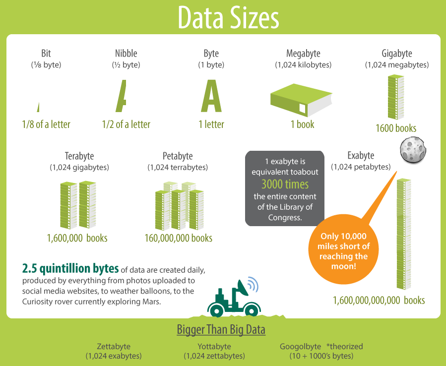
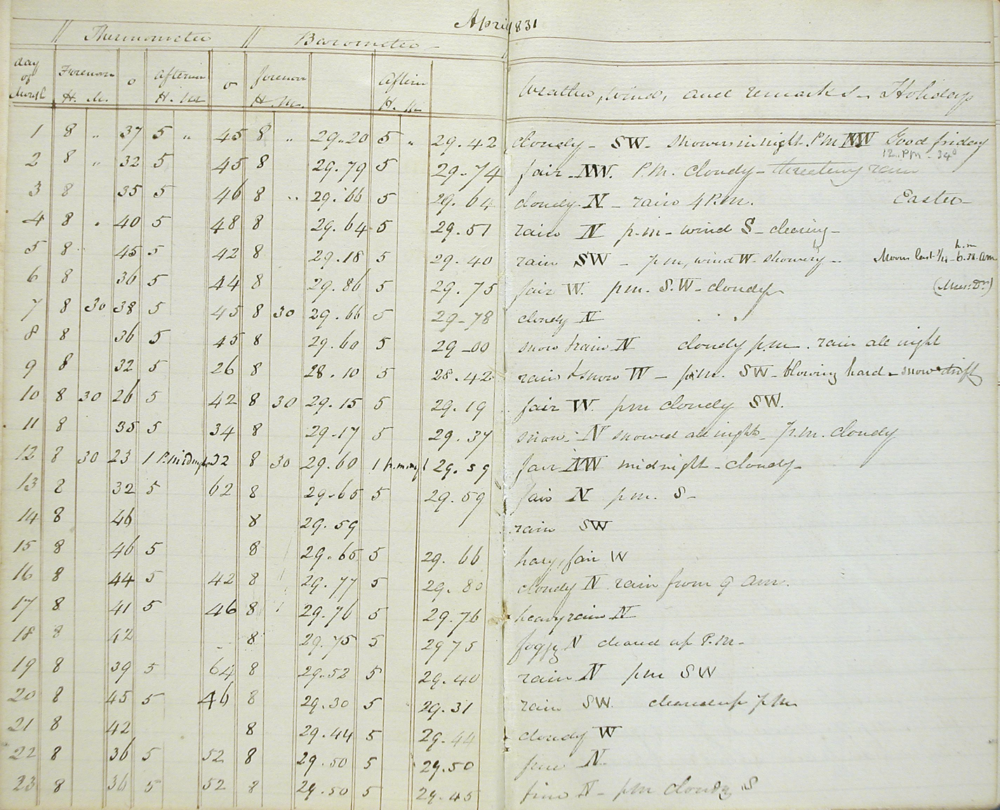
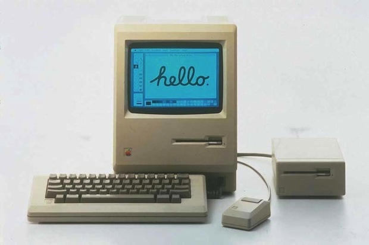
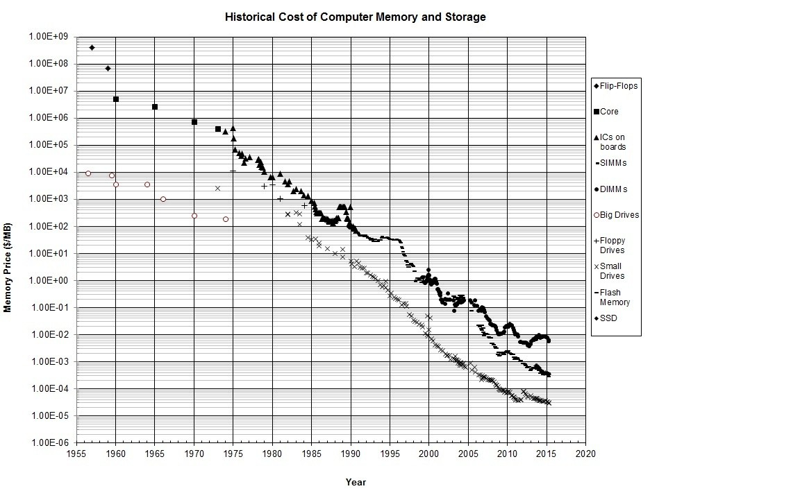
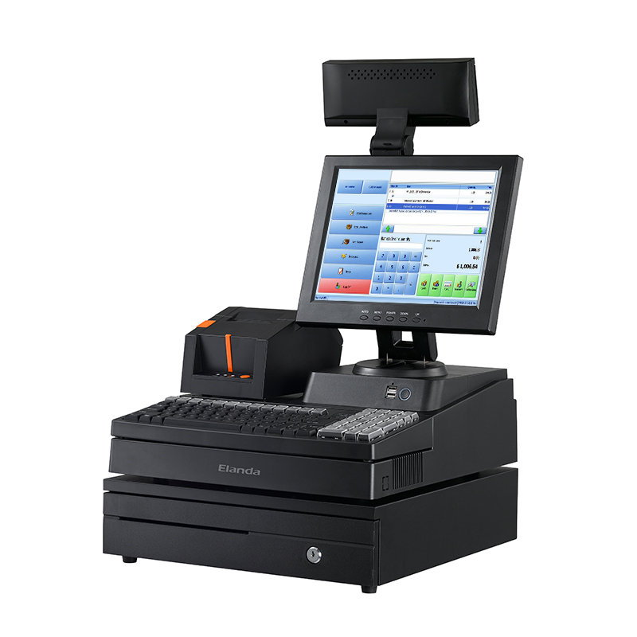
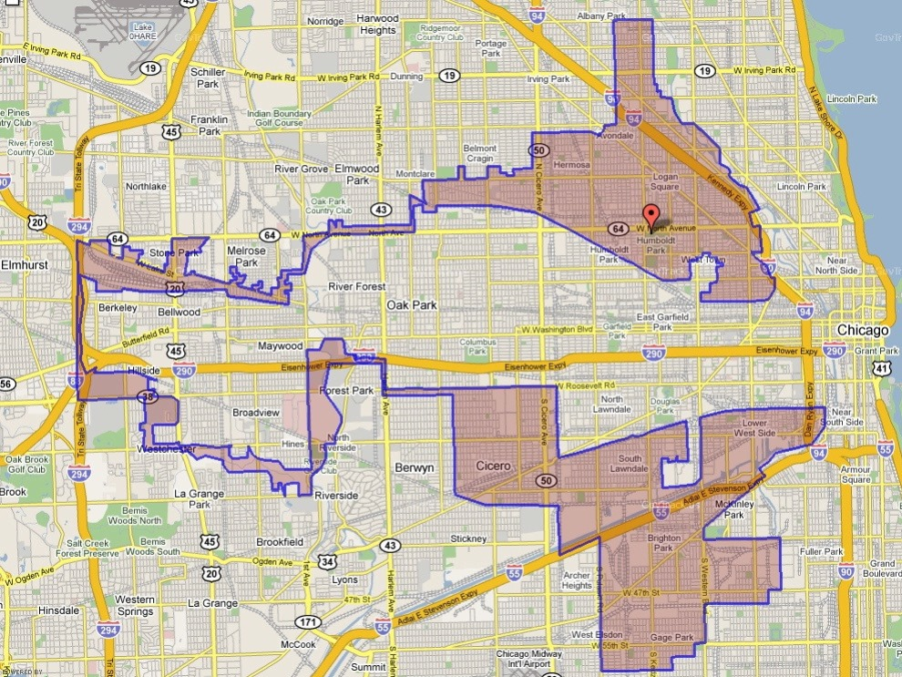
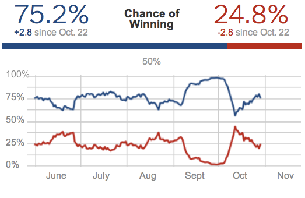
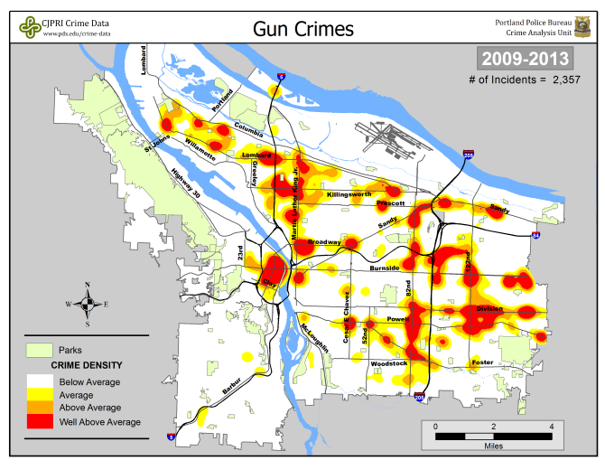

```{r setup, include=FALSE}
options(htmltools.dir.version = FALSE)
```

## General Information

- Office hours: MF 2-3, TuTh 12-3, and W 2-4

--

- Textbook: No required textbook

- Optional reading:
  - (Non-technical) *Big Data - A revolution that will transform how we live, work, and think*, by Viktor Mayer-Schonberger and Kenneth Cukier
  - (Non-technical) *Taming the Big Data Tidal Wave: Finding Opportunities in Huge Data Streams with Advanced Analytics*, by Bill Franks
  - (Techical) *Big Data Analytics with R*, by Simon Walkowiak
  - (Techical) *Hadoop: The definitive Guide*, by Tom White
  - (Technical) *Text Mining with R*, by Julia Silge and David Robinson (Free online)
  
--

- Labs: weekly, using R and other technologies.
- Assignments: 3-4 in this semester
- Term project: group of 2-3

---
class: center, middle

# What is Big Data and Why Does It Matter?

---
class: center, middle

# Data/Big Data
### is at the center of most things

---
class: center, middle

# Data/Big Data
### is at the center of *everything*

---
# First definition of "Big Data"

- From Gartner's Marv Adrian in Q1, 2011 *Teradata magazine*:

*“Big data exceeds the reach of commonly used hardware environments and software tools to capture, manage, and process it within a tolerable elapsed time for its user population.” *

--

- From McKinsey Global Institute in May 2011:

*“Big data refers to data sets whose size is beyond the ability of typical database software tools to capture, store, manage and analyze.”*

---
class: center, middle



---
class: center, middle

# How did we get here?

---
class: center

# Data was *Manual*



---
class: center

# Data was *Expensive*

```{r, out.width='50%', fig.align='center', echo=FALSE}

```

---
class: center

# Data is Cheap



---
class: center

# Data is *Automated*

```{r, out.width='50%', fig.align='center', echo=FALSE}

```

Physical devices

---
class: center

# Data is *Automated*


Physical devices

Software logs

---
class: center

# Data is *Ubiquitous*

```{r, out.width='50%', fig.align='center', echo=FALSE}
knitr::include_graphics('images/iphone.png')
```

Phones

GPS/Cars

Internet of Things

---
class: center, middle

# What are we doing with all this data?

---
class: center

# Understanding and Targeting Customers


--

```{r, out.width='50%', fig.align='center', echo=FALSE}
knitr::include_graphics('images/netflix.jpg')
```


---
class: center

# Politics

```{r, out.width='50%', fig.align='center', echo=FALSE}

```

--

```{r, out.width='50%', fig.align='center', echo=FALSE}

```

---
class: center

# Sports Analytics

<iframe width="560" height="315" src="https://www.youtube.com/embed/5Sq_Z6Um3UM" frameborder="0" allow="autoplay; encrypted-media" allowfullscreen></iframe>

---
class: center

# Improving Security and law Enforcement


```{r, out.width='75%', fig.align='center', echo=FALSE}

```

---

# Many other applications of big data

- Improving Science and Research
- Improving Healthcare and Public Health
- Understanding and Optimising Business Processes
- Personal Quantification and performance Optimisation
- Improving and optimising cities and counties
- Financial Trading

---

# Is The "Big" part or the "Data" part more important?

1. The "big" part
2. The "data" part
3. Both
4. Neither

---

# Big Data Analytics

- Big data is big not just in terms of volume, but also in terms of variety, velocity, and complexity.
- The power of big data is in the analysis you do and the actions you take. It is in neither the “big” part nor the “data” part