```{r setup, include=FALSE}
options(htmltools.dir.version = FALSE)
knitr::opts_chunk$set(eval=FALSE)
```

# Characteristics of RDBMS - Persistent Data

- the data survives after the process with which it was created has ended.

--

- Most computer architecture has two storage areas: **disk** and **main memory**

--

.pull-left[
**DISK:**

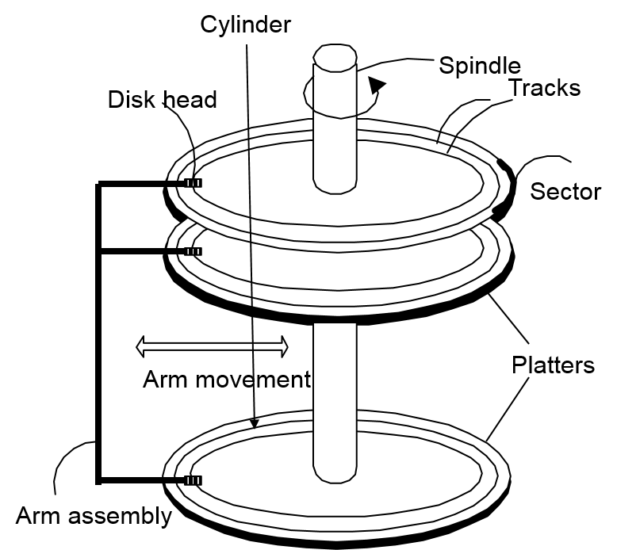
]

--

.pull-right[

- Slow: Sequential access 

- Durable : assume that once on disk, data is safe!

- Cheap
]

---
.pull-left[
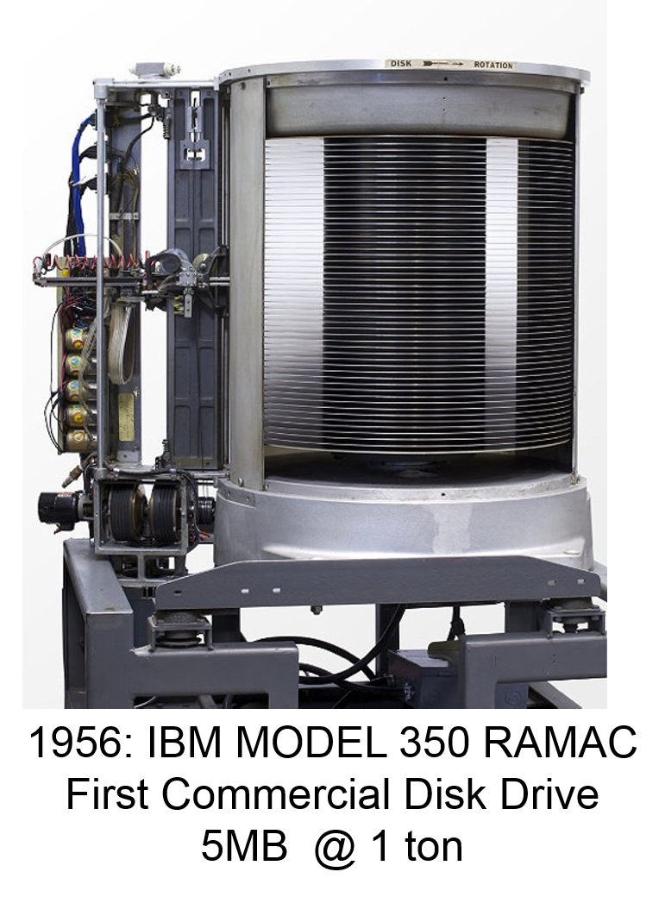
]

--

.pull-right[

<br>

*DBMS symbol:*

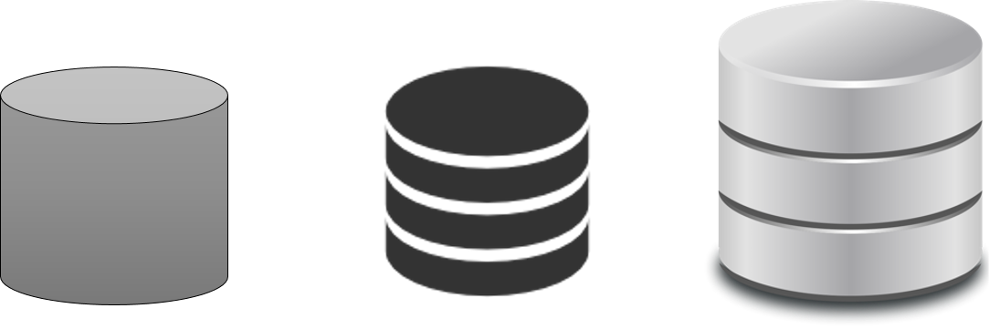
]
---
# Disk vs. Main Memory

.center[Random Access Memory (RAM) or **Main Memory**]

<br>

.pull-left[
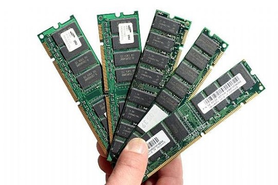
]

--

.pull-right[

- Fast: random access, byte addressable

  - About 10x faster for *sequential access*
  
  - About 100,000x faster for *random access*
  
- Volatile

  - Data can be lost, if e.g., crash occurs, power goes out, etc.
  
- Expensive

  - For $100, get 16 GM of RAM vs. 4  TB of disk.
]

---
# Disk vs. Main Memory

**Trade-off**:

- Main memory: fast but limited capacity, volatile

- Disk: slow but large capacity, durable

--

The RDBMSs keep data persistent and durable (preferred as **recovery & durability**) in the face of crashes, aborts, system shutdowns, etc.

--

.center[**How do we effectively utilize both ensuring these critical guarantees?**
]

---
# Transactions: Basic Definition

- A **transaction ("TXN")** is a sequence of one or more *operations* (reads or writes) which reflects *a single real-world transition*.

--

- In the real world, a TXN either happened completely or not at all

--

```{r}
START TRANSACTION
	UPDATE Product
	SET Price = Price – 1.99
	WHERE pname = ‘Gizmo’
COMMIT
```

---
# Transactions: Basic Definition

- A **transaction ("TXN")** is a sequence of one or more *operations* (reads or writes) which reflects *a single real-world transition*.

- In the real world, a TXN either happened completely or not at all

--

**Examples:**

- Transfer money between accounts

- Purchase a group of products

- Register for a class (either wait-list or allocated)

---
# Transactions in SQL

- In "ad-hoc"  SQL: 

  - *Default:* each statement = one transaction
  
--
  
- In a program, multiple statements can be grouped together as a transaction:

```{r}
START TRANSACTION
	UPDATE Bank SET amount = amount – 100 
	WHERE name = ‘Bob’
	UPDATE Bank SET amount = amount + 100 
	WHERE name = ‘Joe’
COMMIT
```

---
# Motivation for transaction concept

- Protect against crashes / aborts

```{r}
INSERT INTO SmallProduct(name, price) #<<
SELECT pname, price #<<
FROM Product #<<
		WHERE price <= 0.99 #<<

DELETE Product
	WHERE price <=0.99
```

- **What goes wrong if crash/abort occurs after `INSERT` statement, but before `DELETE` statement?**

---
# Motivation for transaction concept

- Protect against crashes / aborts

```{r}
START TRANSACTION #<<
  INSERT INTO SmallProduct(name, price) 
  SELECT pname, price 
  FROM Product 
		WHERE price <= 0.99 

  DELETE Product
	  WHERE price <=0.99
COMMIT OR ROLLBACK #<<
```

- Either both queries executed or DBMS rollback any changes in this aborted transaction.

---
# Motivation for transaction concept - Concurrency

- Concurrent execution of user programs is essential for good DBMS performance

--

  - Disk accesses may be frequent and **slow**

--

  - Users should still be able to execute TXNs as if in **isolation** and such that **consistency** is maintained
  
--

- **Idea:** Have the DBMS handle running several user TXNs concurrently, in order to keep CPUs humming...

---
# Transaction Properties (Requirements): **ACID**

- **A**tomic

  - State shows either all the effect of TXN, or none of them

--

- **C**onsistent

  - TXN moves from a state where integrity holds, to another where integrity holds

--

- **I**solated

  - Effect of TXNs is the same as TXNs running one after another (i.e., looks like batch mode)
  
--

- **D**urable

  - Once a TXN has committed, its effects remain in the database
  
---
# **A**CID: **A**tomicity

- TXN's activities are tomic: **all or nothing**

  - *Intuition:* in the real world, a transaction is something that would either occurs *completely* or *not at all*
  
- Two possible outcomes for a TXN

  - It *commits:* all the changes are made
  
  - It *aborts:* no changes are made
  
---
# A**C**ID: **C**onsistency

- The tables must always satisfy user-specified **integrity constraints**

  - Examples:

    - Account number is unique
    
    - Stock amount can’t be negative
    
    - Sum of debits and of credits is 0

--

- How consistency is achieved:

  - Programmer makes sure a txn takes a consistent state to a consistent state
  
  - System makes sure that the txn is **atomic**

---
# AC**I**D: **I**solation

- A transaction executes concurrently with other transactions

- **Isolation:** the effect is as if each transaction executes in *isolation* of the others.

  - Example: Should not be able to observe changes from other transactions during the run
  
---
# ACI**D**: **D**urability

- The effect of a TXN must continue to exist ("**persist**") after the TXN

  - And after the whole program has terminated
  
  - And even if there are power failures, crashes, etc.
  
  - And etc…

- Means: Write data to **disk**

---
# Concurrency: Isolation & Consistency

The DBMS must handle concurrency such that...

1. **Isolation** is maintained: Users must be able to execute each TXN **as if they were the only user**

  - DBMS handles the details of *interleaving* various TXNs
  
--

2. **Consistency** is maintained: TXNs must leave the DB in a **consistent state**

  - DBMS handles the details of enforcing integrity constraints

---
# Example of two TXNs

.pull-left[

```{r}
START TRANSACTION
	UPDATE Accounts
	SET Amt = Amt + 100
	WHERE Name = ‘A’;
	
	UPDATE Accounts
	SET Amt = Amt - 100
	WHERE Name = ‘B’;
COMMIT
```

T1 transfers $100 from B's account to A's account
]

--

.pull-right[

```{r}
START TRANSACTION
	UPDATE Accounts
	SET Amt = Amt * 1.06
COMMIT
```

T2 credits both accounts with 6% interest payment
]

---
# Example of two TXNs


We can look at the TXNs in a timeline view- serial execution:

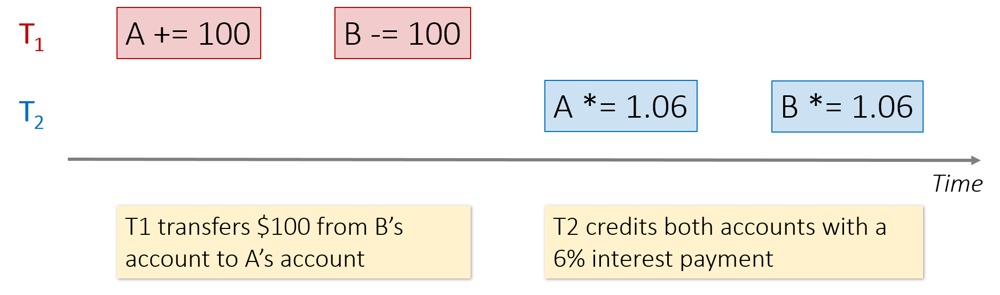

---
# Example of two TXNs


The TXNs could occur in either order... DBMS allows!

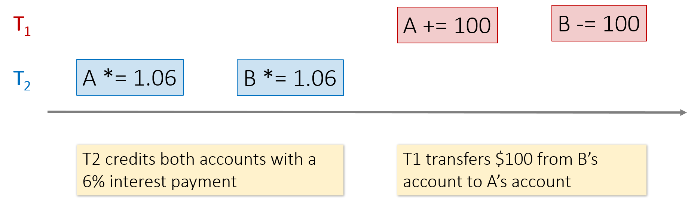

---
# Example of two TXNs


The DBMS can also **interleave** the TXNs

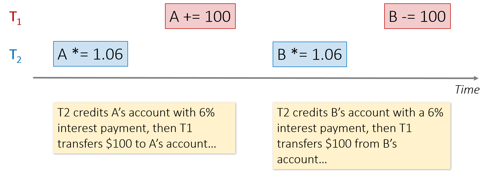

---

# Why interleave TXNs?

--

- Individual TXNs might be **slow** - don't want to block other users during!

- Disk access may be **slow** - let some TXNs use CPUs while others accessing disk!
  
--

- The DBMS has freedom to interleave TXNs
  
- However, it must pick an interleaving (or schedule) such that isolation and consistency are maintained

  - Must be **as if** the TXNs had executed serially!  
  
---
# Data in the Organization

--

### How do we like to think of data in the organization

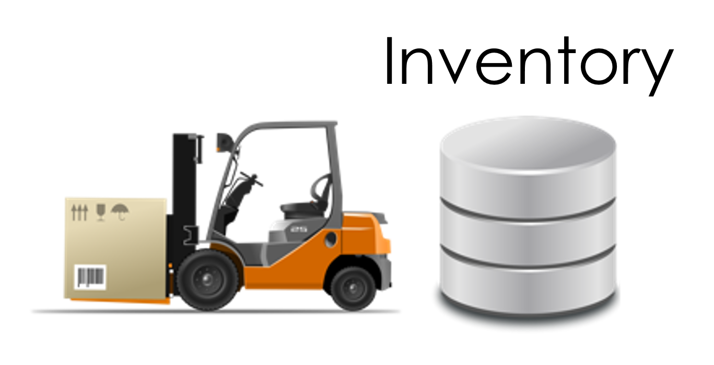

---
# The reality ...

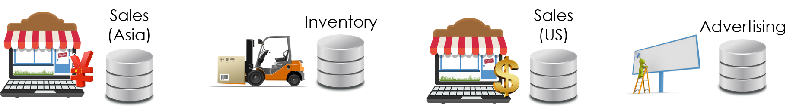

--

- Capture **the now**

- Many different databases across an organization

- Mission critical

  - Serving live ongoing business operations
  
  - Managing inventory
  
- Different format (e.g., currentcy), different schema (acquisitions...)

- Live systems often don't maintain history

---
# Data warehouse

.pull-left[
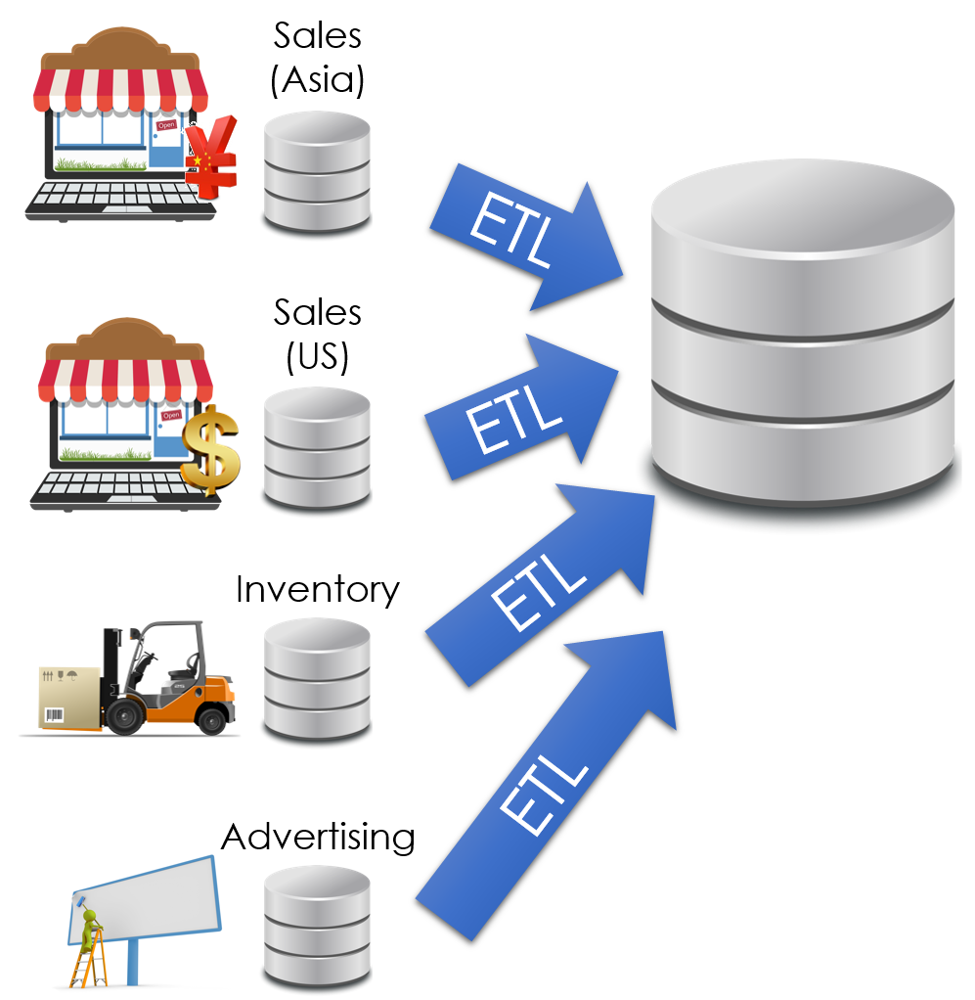
]

.pull-right[
Data is periodically ETLed into the data warehouse:

- Extracted from remote sources

- Transformed to standard schemas

- Loaded into the (typically) relational (SQL) data system
]

---
# **E**xtract $\rightarrow$ **T**ransform $\rightarrow$ **L**oad (ETL)

**Extract & Load:** provides a snapshot of operational data

- Historical snapshot

- Data in a single system

- Isolates analytics queries (e.g., Deep Learning) from business critical services (e.g., processing user purchase)

- Easy!

--

**Transform:** clean and prepare data for analytics in a unified representation

- **Difficult** $\rightarrow$ often requires specialized code and tools

- Different schemas, encodings, granularities

---
# Data warehouse

.pull-left[
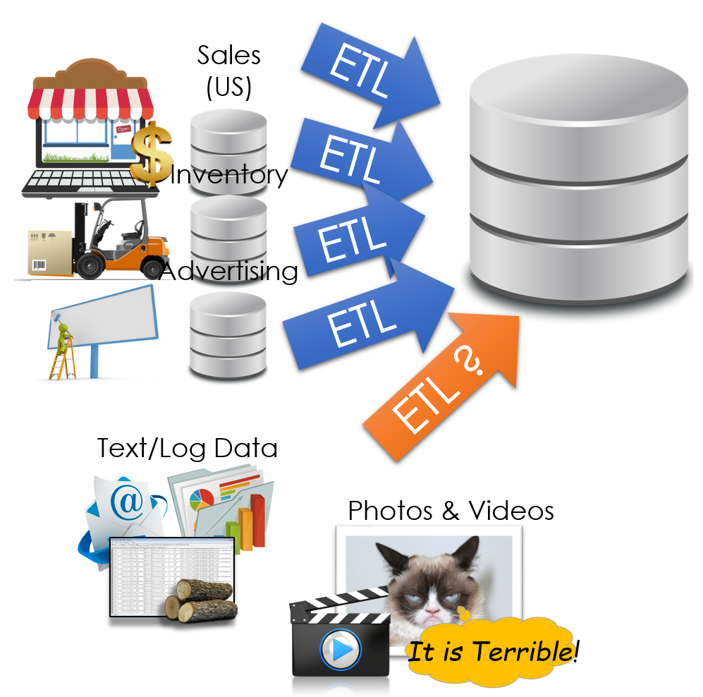
]

.pull-right[

- How do we deal with semi-structured and unstructured data?

- Do we really want to force a schema on load?

  - A bonary large object (**BLOB**)

]

---
# Data Lake

.pull-left[
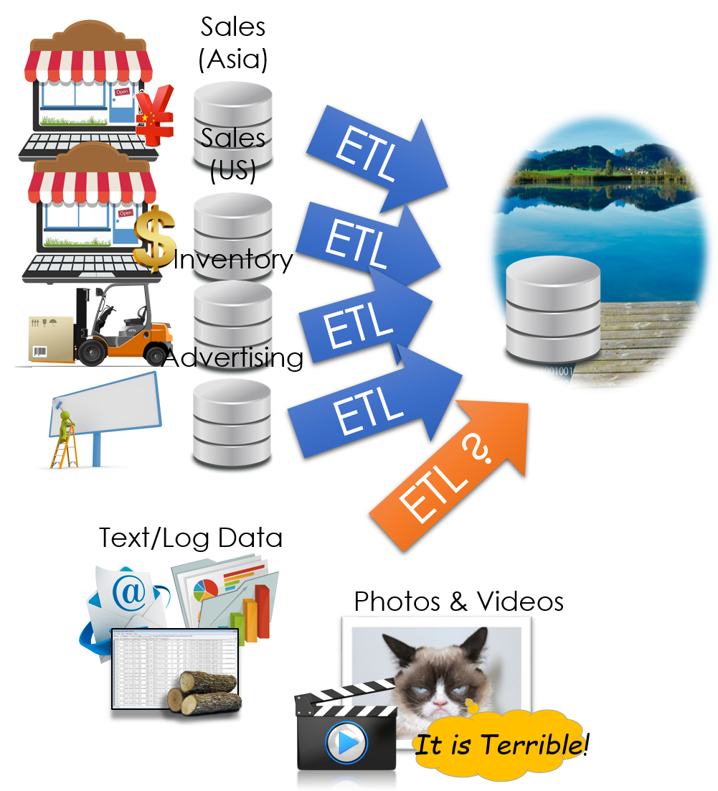
]

.pull-right[

- Still being defined...

- Store a copy of all the data 

  - in one place 
  
  - in its original “natural” form
  
- Enable data consumers to choose how to transform and use data.

  - Schema on Read
]

---
# The Dark side of Data Lakes

- Cultural shift: Curate $\rightarrow$ Save Everything!

  - Noise begins to dominate signal
  
- Limited data governance and planning
  
  - Example: `hdfs://important/joseph_big_file3.csv_with_json`

  - What does it contain? 

  - When and who created it?
  
- No cleaning and verification $\rightarrow$  lots of dirty data

- New tools are more complex and old tools no longer work
