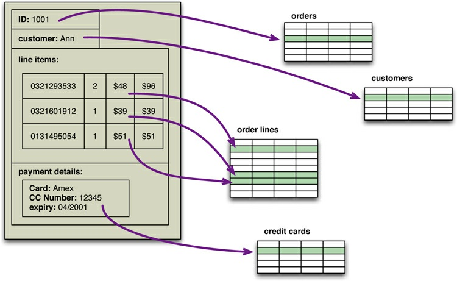
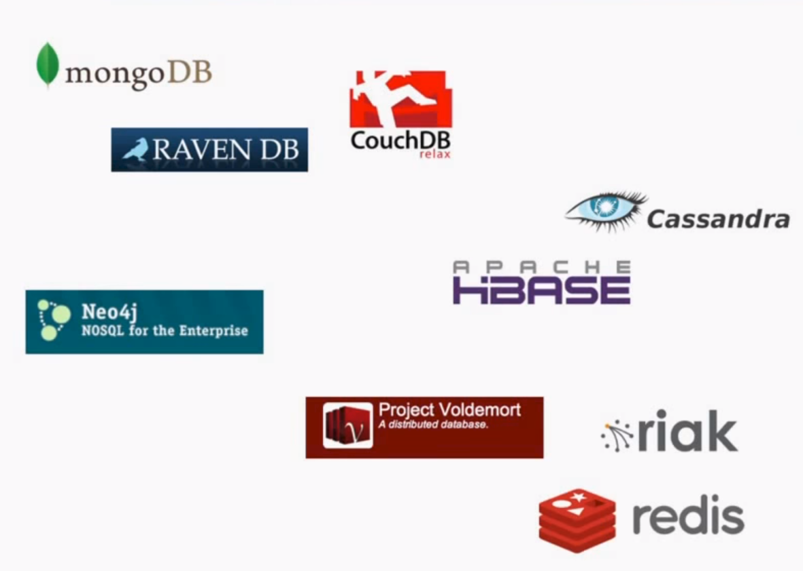
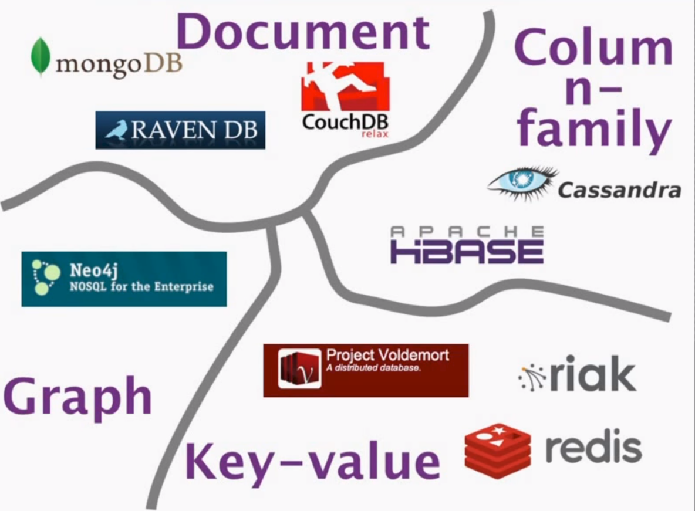
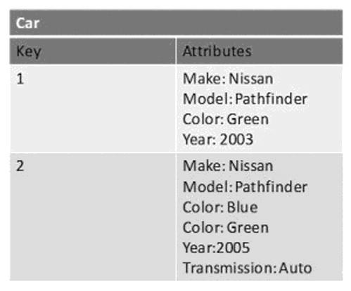
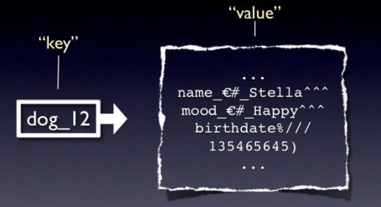
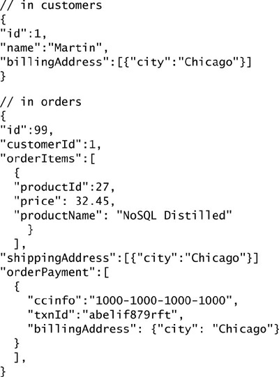
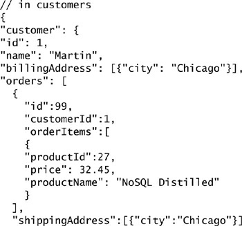
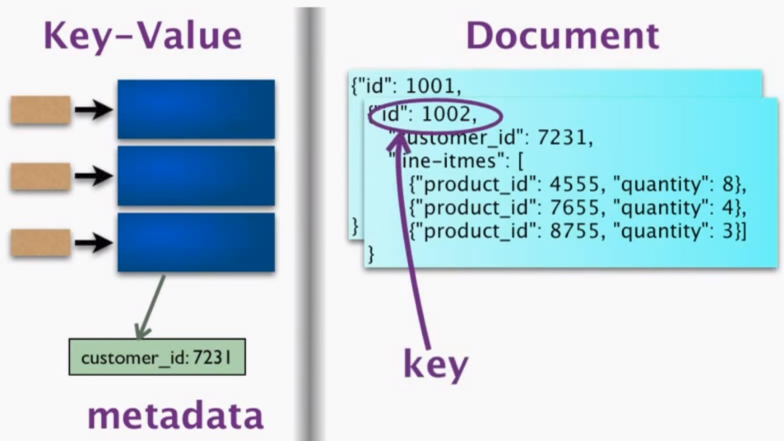

```{r setup, include=FALSE}
options(htmltools.dir.version = FALSE)
knitr::opts_chunk$set(eval=FALSE)
```

# The rise of the RDBMS - Creating Manageable Data Structures

--

- In the 1960s, data was stored in flat files that imposed no structure
  
  - Example: CSV (Common separated value) files, text files 
    
- Companies created their own program to analyse their data
  
--

- RDBMS and SQL were invented in the late 1070s
  
- Marked the rise and dominance of relational database
  
---
# What make RDBMS popular?

- Persistence

--

- Design for all purposes 

  - Data model: entity-relationship model
  
  - Data abstraction
  
  - Data Normalization

--
  
- Integration (e.g., data mart, data warehouse)

--
    
- SQL Transaction

  - Strong consistency, concurrence, and recovery
  
  - ACID
  
--

- Reporting: allow third parties to access databases and create reports based upon the stored data

  - Example: R/RStudio accesses RDBMS, extract data, and create charts
  
---
# Weakness of RDBMS - Web, Content Management and the Explosion of Data

- The Internet happened in early 1990s and became ubiquitous in 2000s

--

- The world has experienced the rapid change, but RDBMSs can't handle changes

  - Relational Schema: often complex, take time and efforts to build good schema
  
  - Data abstraction makes RDBMS very effective for the given schema
  
  - Single change to the schema (even adding or replacing a column) might be a *million dollar task*.
  
--

- Web has brought a lot of unstructured data: HTML, XML, etc.

  - ETLs become difficult and labor intensive.
  
  - On-line versus off-line database, i.e., optimization for speed vs. for storage
  
  - BLOBs do not help much
  
---
# Weakness of RDBMS 

**Scaling RDBMS is very hard.** What scale means?
  
- **Scale up** (vertical scaling): grow the size of the database. 
    
  - Example: When running out of storage space on Dropbox, you buy and add more space to your account.
    
  - Can't scale up once the performance and/or capacity limits of the storage controllers are reached.
  
--
  
- **Scale out** (horizontal scaling): distribute the large database on multiple machines (servers)
    
  - Example: Cluster of machines and storage
    
--

  - In theory, relational data model scales just fine, it's just an _interface_
  
--
	      
	- In practice, many SQL databases not built to scale. 
	
	  - They must live in a single machine.
	  
	  - very hard to predict SQL performance

---
# Most severe weakness of RDBMS - Mismatch for Modern App Development

- Most modern application are developed using object-oriented programming languages, such as Java, C++, Python, etc., which treat data structures as "objects"

--

```{r, out.width='75%', fig.align='center', echo=FALSE, eval=TRUE}

```


---
# The beginning of NoSQL

Many people tried to address the shortcoming of RDBMSs

- Developers built their own databases
  
  - Rails community basically rebuilt from scratch
    
  - MongoDB originally written by ads back-end folks
  
--
    
- Hadoop framework was proposed, at least their fundamental concepts

- Google developed *BigTable*

- Amazon developed *Dynamo*

--

- Sparked a movement of databases called **NoSQL**

---
# Definition of NoSQL

- NoSQL systems are referred to as **Not Only SQL** to emphasize that they do in fact allow SQL-like query languages to be used.

--

- No concensus definition, but can be described by its characteristics

--

- Characteristics:

  - non-relational
  
  - open-source
  
  - cluster-friendly
  
  - 21-st century web
  
  - schema-less
---

---

---
# Key-value data model

.pull-left[




]

--

  - Simplest NoSQL databases

  - Data model: (key, value) pairs

  - Value has no required format

  - Use hash table

---
# Document data model

.pull-left[

]

.pull-right[

]
---
# Document data model

- Provides flexibility, ease to transmit through the network

- Compared to the key-value, document databases provide the transparency 

- Compared to the RDBMS, document databases are schema-less

  - When serving a specific purpose, it carries an implicit schema.

---

---
# Key-value versus document

- While values in key-value databases are viewed as opaque objects, they often come with metadata that describe the content of the value

  - Example: metadata has a field for customer ID
  
- Records in document database usually have keys, which seems to be like the key in key-value databases.

- The line between key-value and document databases is quite blur.

--

- Common theme: aggregate-oriented databases (coined by Martin Fowler)

- Idea: domain-driven design (book written by Eric Evans)

--

- Example: In the database for online store, order is a aggregate with multiple line items.
