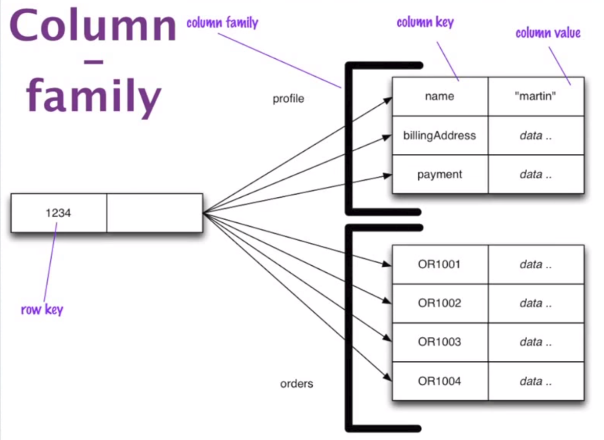

```{r setup, include=FALSE}
options(htmltools.dir.version = FALSE)
knitr::opts_chunk$set(eval=FALSE)
```

# Characteristics of NoSQL

--

- non-relational

- open-source

- cluster-friendly

- 21-st century web

- schema-less

--

```{r, out.width='75%', fig.align='center', echo=FALSE, eval=TRUE}

```

---

---
# Key-value data model

```{r, out.width='50%', fig.align='center', echo=FALSE, eval=TRUE}

```

--

```{r, out.width='50%', fig.align='center', echo=FALSE, eval=TRUE}
knitr::include_graphics('images/key-value-2.jpg')
```


---
# Document data model


---

---
# Aggregate-oriented Data Model

- Inspired by Domain-driven design, aggregare is a collection of related objects that we wish to treat as a unit.

.pull-left[


*Aggregate database*
]

--

.pull-right[


*RDBMS*
]
---
# Why these databases are useful?

- Aggregates make it easier for the database to manage data storage over clusters.

  - Spread aggregates across multiple nodes (machines) and can be retrieve simultaneously.

--

- Aggregate-oriented databases work best when most data interaction is done with the same
aggregate

--

- *Drawback:*

  - Changing the aggregate structure is hard, complicate and time-comsuming.
  
  - Not useful when interactions use data organized in many different formations.
  
---


---
# Graph databases

Graph databases organize data into node and edge graphs; they work best for data that has
complex relationship structures.

```{r, out.width='75%', fig.align='center', echo=FALSE, eval=TRUE}

```

---


---
# Distribution Models

- Most attractive feature of NoSQL is its ability to run databases on a large cluster

  - Easy to scale out
  
--

- Great distribution model allows us to handle larger quantities of data, to be efficient ETLs, to have more availability when the network slowdowns or breakages.

--

- Two different types of distribution models:

  1. **Replication:** Copy the same data over multiple nodes (machines)
  
  2. **Sharding:** Puts different data on different nodes
  
--

- A system may use either or both techniques.

---
# NoSQL and Consistency

- In RDBMS, we have **ACID**. In NoSQL, there is a similar concept called **BASE**

--

- Example of consistency:

```{r, out.width='50%', fig.align='center', echo=FALSE, eval=TRUE}

```

--

- In NoSQL, graph databases are also ACID-compliant
---

---

---

---

---

---

---

---

---

---

---

---

---
# Consistency

- There are two types of consistency: **logical** and **replication**

--

- Replication consistency rises when we have data spread across a cluster of nodes (machines)

--

- Example: Martin and Pramod try to book a room on New Year Eve in NYC. Hypothetically, there is only one room available in Time Square area.

  - What happens when Martin and Pramod request the room simultaneously?
  
--

  - Assume that Martin and Pramod live in two different continents. They interact with two different replications, whose connection is not available.
  
---

---

---

---


---
# The CAP Theorem

- Known as: "Among **Partition Tolerance**, **Availability**, and **Consistency**, pick any two".

--

- Also rephrased as: When the system live on partitioned network, it can be either **consistent** or **available**

--

- In reality, consistency vs. availability is not a binary choice, but a wide spectrum of trade-offs.

---
# SQL vs NoSQL

- No right or wrong choice between SQL and NoSQL

- Database Integration is a bad choice, as it reduces the flexibility.

- Use different technologies for different purposes.

- Service encapsulation supports changing data storage technologies as needs and technology
evolve.