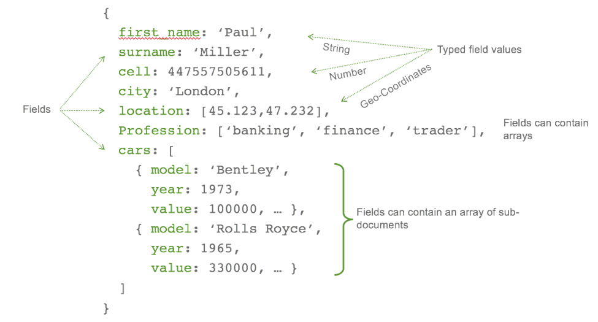

```{r setup, include=FALSE}
options(htmltools.dir.version = FALSE)
knitr::opts_chunk$set(eval=FALSE)
```

# Introduction to MongoDB

- MongoDB is a NoSQL database software using JSON-like documents with schemas (loosely defined).

- MongoDB is free and open-source cross-platform database.

--

- You can download and install on your machine. Instruction at [https://docs.mongodb.com/manual/installation/](https://docs.mongodb.com/manual/installation/)

- Several R packages have been created to interact with MongoDB. A fast and simple one that we will use is `mongolite`.

- *Note:* R does not support document type; hence, all extracted data will be converted to either `data frame` or `list`.

---
# Documents in MongoDB

- Documents are stored in format based on [JSON specification](http://www.json.org/)


--


--


---
# JSON-like document in MongoDB


---
# JSON-like document in MongoDB

- Documents are not just key-value pairs, but can include arrays and subdocuments.

- Support many other data types: geospatial, decimal, Data, etc.

- While JSON-type is text-based, MongoDB also support binary-encoded JSON format, **BSON**

---
# MongoDB

- MongoDB is made up of `databases` which contain `collections`. 

- A `collection` is made up of `documents`. 

- Each `document` is made up of `fields`. 

- Collections can be indexed, which improves lookup and sorting performance. 

--

| Relational Concept | MongoDB Equivalent | 
|--------------------|--------------------|
| Database | Database |
| Table | Collections |
| Rows (Tuples) | Documents | 
| Index | Index |

---
class: center, middle

# Example on the MongoDB console

---
class: cneter. middle

# Lab 4 - Intro to MongoDB with R