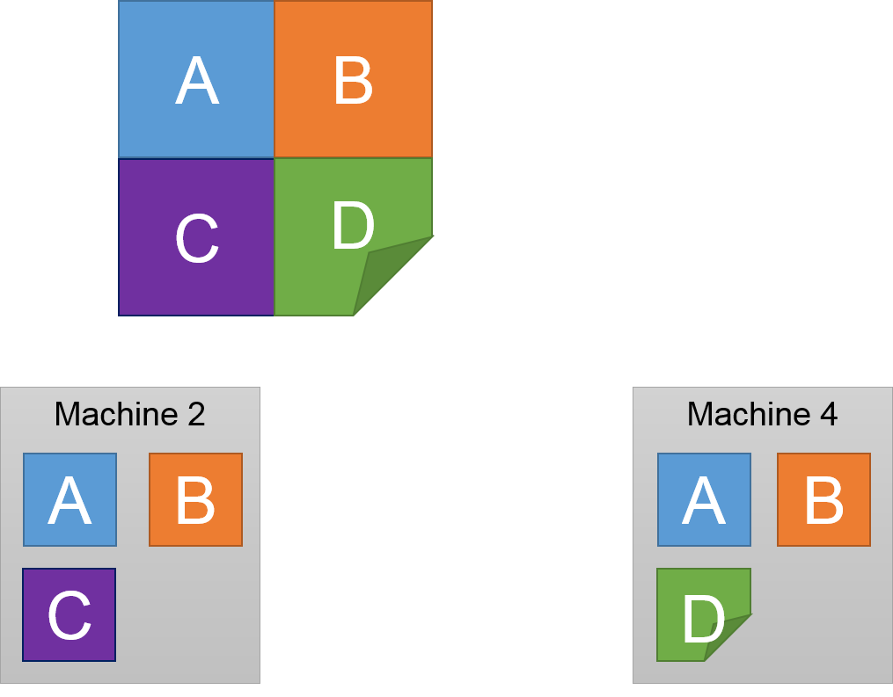

```{r setup, include=FALSE}
options(htmltools.dir.version = FALSE)
knitr::opts_chunk$set(eval=FALSE)
```

# Aggregation Framework in MongoDB

- An advance query language to transform and combine data from multiple documents. 

- The MongoDB's eqivalence to the SQL's `GROUP BY` clause.

--

- A call to the aggregation framework defines a pipeline, the **aggregation pipeline**, where the output from each step in the pipeline provides input to the next step.


---
# Aggregation pipeline operations

| SQL command | Aggregation operator | Meaning |
|-------------|----------------------|---------|
| SELECT | `$project` | Specify fields in the output document |
|  | `$group` functions | Ex: `$sum`, `$min`, `$avg`, etc.
| FROM |  | Specify in `collectionName$aggregate(...)` |
| JOIN |  | There is no join in MongoDB | 
|  | `$unwind` | Expand an array, one document for each array entry |
| WHERE | `$match` | Select documents to be processed |
| GROUP BY | `$group` | Group documents by a specified key |
| HAVING | `$match` | Select documents to be processed |
| ORDER BY | `$sort` | Sort documents |
| LIMIT | `$limit` | Limit the number of output documents |
|   | `$out` | Write the results to a collection |

---
# An example

```{r}
collection$aggregate('[ {$match: ...}, {$group: ...}, {$sort: ...} ]')
```


--

```{r}
SELECT * 
  FROM myCollection
  WHERE ...
  GROUP BY ...
  ORDER BY ...
```

--

- While SQL follows their standard order, MongoDB pipeline follows the order of operators given in the query.

---
# Another example

- Consider a collection, named `sales`, containing sales records of stores across the world.

- We'd like to compute the volume and the average revenue per country

```{r}
sales$aggregate( '[{
         "$group" : {
              "_id" : "$country", 
              "totalRevenue" : {"$average" : "$revenue"},
              "numSales" : {"$sum" : 1}
         }
}]')
```

- `$group` operator always has `"$id" : $<field name>`

- Grouping with multiple fields: `{"$group" : {"_id" : {"state" : "$state", "city" : "$city"}}}`

---
# And another example

- To find which item being loves the most in our current running example

```{r}
example$aggregate('[
                  {"$unwind" : "$loves"},
                  {"$group" : {"_id" : "$loves",
                               "total" : {"$sum" : 1}}},
                  {"$sort": {"total" : -1}},
                  {"$limit" : 1}
]')
```

- Run the above query and verify the result
---
# Activity - Chicago crimes data

**Question:** Where fo most crimes take place?

```{r}
crimes <- mongo(collection = "crimes", db = "Chicago",
    url = "mongodb://<USERNAME>:<PASSWORD>@<IP ADDRESS>/test"))
```

<br>

.center[ **Give me the list of top 10 places and their total counts**]

---
# Distribution Models - Distributed File Systems

- How do we **store** and **access** *very large files* across **cheap** commodity devices ?

--

- There are two distribution models: **Sharding** and **Replication**

  1. *Sharding:* split the file into smaller parts and distribute them across machines
  2. *Replication:* put copies of the original data across machines.
  
```{r, out.width='50%', fig.align='center', echo=FALSE, eval=TRUE}

```

---
# Distributed File System


---
# Distributed File System


---
# Distributed File System


---
# Distributed File System


---
# Distributed File System


---
# Fault Tolerant Distributed File Systems 
# Failure Event Occurs

```{r, out.width='50%', fig.align='center', echo=FALSE, eval=TRUE}

```

---
# Fault Tolerant Distributed File Systems 
# Failure Event Occurs

```{r, out.width='50%', fig.align='center', echo=FALSE, eval=TRUE}

```

---
# Map-Reduce Distributed Aggregation

- MongoDB system allows both distribution models. 

- The MongoDB's aggregate framework offers limited functionalities.

- How to do computing when data files (i.e., databases) distributed across multiple machines?

--

- Analogue: How would you **compute the number of occurrences** of each word in all the books **using a team of people?**

---
# Simple solution


---
# Simple solution

```{r, out.width='75%', fig.align='center', echo=FALSE, eval=TRUE}

```


---
# Simple solution


---
# Simple solution


---
# The Map Reduce Abstraction


---
# Key properties of Map and Reduce

- **Deterministic MAP:** allows for re-execution on failure

  - If some computation is lost we can always re-compute
  
  - Issue with samples?
  
--

- **Commutative REDUCE:** allows for re-order of operations

  - Reduce( A, B ) = Reduce ( B, A )
  
  - Example (addition): A + B = B + A
  
--

- **Associative REDUCE:** allows for regrouping of operations

  - Reduce( Reduce( A, B), C) = Reduce( A, Reduce( B, C))
  
  - Example (max): max(max(A, B), C) = max( A, max(B, C))

---
# Executing Map Reduce

.pull-left[

```{r, out.width='25%', fig.align='center', echo=FALSE, eval=TRUE}

```

]

.pull-right[

<br>

<br>


<br>

<br>


]

---
.pull-left[

```{r, out.width='55%', fig.align='left', echo=FALSE, eval=TRUE}

```

]

.pull-right[

# Executing Map Reduce

]
---
.pull-left[

```{r, out.width='100%', fig.align='left', echo=FALSE, eval=TRUE}

```

]

.pull-right[

# Executing Map Reduce

<br>

- The map function applied to a local part of the big file.

- **Run in Parallel.**

- Output is cached for fast recovery on node failure


]

---
.pull-left[

```{r, out.width='100%', fig.align='left', echo=FALSE, eval=TRUE}

```

]

.pull-right[

# Executing Map Reduce

<br>

```{r, out.width='100%', fig.align='center', echo=FALSE, eval=TRUE}

```

- Reduce function can be run on many machines...

]
---

.pull-left[

```{r, out.width='55%', fig.align='left', echo=FALSE, eval=TRUE}

```

]

.pull-right[


]

---

```{r, out.width='100%', fig.align='center', echo=FALSE, eval=TRUE}

```

---

```{r, out.width='100%', fig.align='center', echo=FALSE, eval=TRUE}

```

If part of the file or any intermediate computation is lost we can simply recompute it without recomputing everything.

