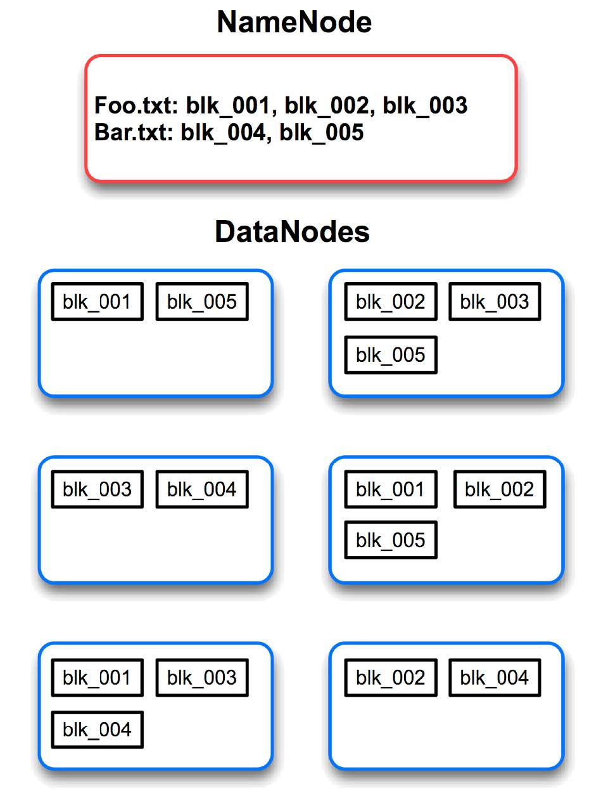

```{r setup, include=FALSE}
options(htmltools.dir.version = FALSE)
knitr::opts_chunk$set(eval=FALSE)
```

# What is Hadoop - A review


- A collection of softwares to support data-intensive distributed application.

--

- Abstract and facilitate the storage and processing of large and/or rapidly growing data sets
  
  - Structured and non-structured data (**HDFS**)
    
  - Simple programming models (**MapReduce**) : Move computation rather than data

--

- High scalability and availability

  - Easy to scale horizontally (i.e., adding more machines)
  
  - Have a little redundancy for fault-tolerance
  
---
# What is Hadoop cluster?

- Definition

--

- Types of nodes: Master and Worker nodes

--

- Two main components: HDFS and YARN

---
# Hadoop Distributed File System

Provides inexpensive and reliable storage for massive amounts of data

- Optimized for a relative small number of large files
  
  - Each file likely to exceed 100 MB, multi-gigabyte files are common
  
--

- Store file in hierarchical directory structure

  - Example: `/sales/reports/asia.txt`
  
  - Use Unix/Linux path style (i.e., forward slash, root, ownership, permissions, etc.)
  
--

- Cannot modify files once written

  - Following "Write Once, Read Many"
  
  - Need to change? remove and recreate
  
  - Not suitable for any applications with constant updates.
  
---
# HDFS Architecture

.pull-left[

]

--

.pull-right[

- Typical block size = 128 MB

- `NameNode` stores all of its file/block information

- Too many files cause "out of space" in `NameNode`

- So do too many blocks

- Block size is adjustable (but applied for the whole system)
]

---
# Accessing HDFS via The Command Line

HDFS is not a general purpose file system

- HDFS files cannot be accessed through the host OS

--
  
- End users typically access HDFS via the `hadoop fs` command

Example:

- Display the content of the `/user/tuan/class-rosters.txt` file

```
hadoop fs -cat /user/tuan/class-rosters.txt`
```

--

- Create a directory (below the root) called `teaching`

```
hadoop fs -mkdir /teaching
```

---
# Copying Local Data To And From HDFS

Remember that HDFS is separated from your local filesystem

- Use `hadoop fs ???put` to copy local files to HDFS

- Use `hadoop fs -get` to copy HDFS files to local files

Example:

```
hadoop fs -put input.txt input.txt
```

Other usefull commands are : `ls` to get directory listing, or `rm` to delete file(s)

---
# In-class Activity

- Create a your profile (a brief bio) and save as an text file

- Create a copy of you profile and name your file with the suffix `_to_be_remove`.

- Create a folder with your name on Hadoop

- Remove one of your classmate profile.

---
# Hadoop Resource Management

- What is YARN?

--

- YARN is the Hadoop processing layer that contains

  - A resource manager
  
  - A job scheduler
  
--

- YARN allows multiple data processing engines to run on a single Hadoop cluster

  - Batch programs (e.g., Spark, MapReduce)
  
  - Interactive SQL (e.g., Impala)
  
  - Advanced analytics (e.g., Spark, Impala)
  
  - Streaming (e.g., Spark Streaming)

---
# YARN processes

- Usually called YARN daemons, i.e., processes run in the background.

--

- Resource Manager (RM)

  - Runs on master node
  
  - Global resource scheduler
  
  - Arbitrates system resources between competing applications
  
  - has a pluggable scheduler to support different algorithms (capacity, fair scheduler, etc.)
  
--

- Node Manager (NM)

  - Run on worker nodes
  
  - Communicates with RM
  
---
# Running an application in YARN

- Containers

  - Created by RM upon request
  
  - Allocate a certain amount of resources (memory, CPU) on a worker node
  
  - Applications run in one or more containers

--

- Application Master (AM)

  - One per application
  
  - Framework/application specific
  
  - Runs in a container
  
  - Requests more containers to run application tasks