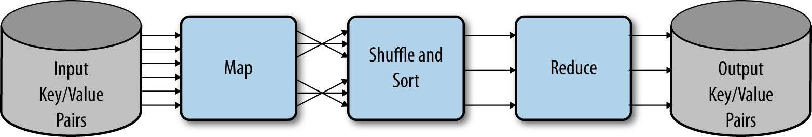
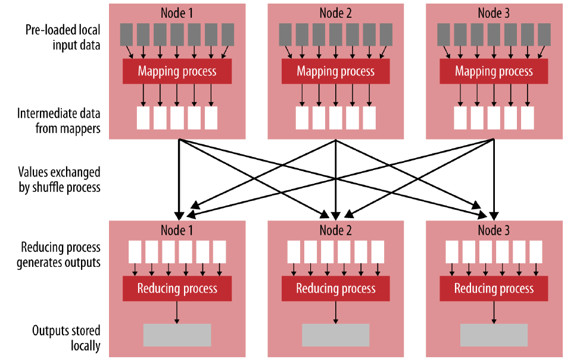
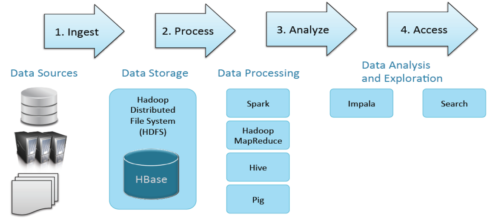
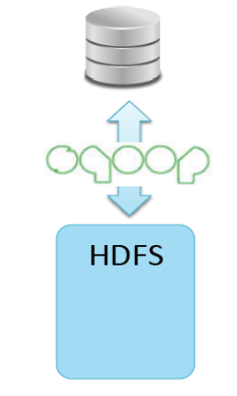
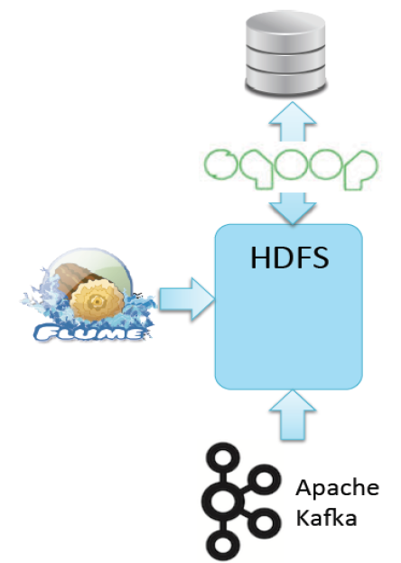
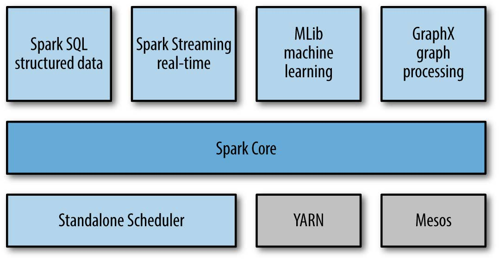

```{r setup, include=FALSE, message=FALSE}
options(htmltools.dir.version = FALSE)
knitr::opts_chunk$set(eval=FALSE)
```

# Hadoop Framework - Review

- Two main components

  - HDFS
  
  - YARN

--

- HDFS can be access via command line: syntax `hadoop fs -<COMMAND>` command

  - Useful command: `cat`, `ls`, `mkdir`, `put`, `get`
  
- HDFS follows Linux directory tree style, has the ower and permission system.

---
# In-class Activity

- Create a your profile (1 sentence to describe you) and save as an text file on your host OS

- Create a folder with your name on Hadoop under `/stat474/`

- Put your profile in your folder in HDFS.

- Find who has lucky stars.

---
# Map Reduce Framework

- MapReduce

  - Proposed by Google Research Group in 2003

  - We typical process data in Hadoop using MapReduce
  
--
  
- MapReduce in not a language, it is a programming model

  - Implemented in Java, Scala, Python 
  
--

- MapReduce consists of two functions: **map** and **reduce**

---
# Understanding **Map** and **Reduce**

- The **map** function always runs first

  - Use to "break down"
  
  - Output from the map function (eventually) becomes the input to the *reduce* function
  
--

- The **reduce** function

  - Use to aggregate data from the *map* function
  
  - Not always needed and therefore optional
  
--

- Between these two tasks there is typically a hidden phase known as the "Shuffle
and Sort" 

---
# MapReduce Framework


---
# MapReduce Framework


---
# Pros and Cons of MapReduce

**Advantages**

- Simplicity (relative to other distributed programming models)
  
- Flexibility: More analytics capabilities and works with more data types
  
- Scalability: Small quantities of data at a time, running in parallel across a cluster, sharing nothing among the participating nodes
    
--

**Disadvantages**

- Slow: 
  
  - Sort and shuffle stage takes long time with large amount of keys
  
  - MapReduce tends to write interim results to a disk
    
- Hand code map function to deal with different data types.
  
---
# Hadoop Framework - Big Data Processing



---
# Data Storage

- Hadoop Distirbuted File System (HDFS)

  - Storage layer for Hadoop
  
  - Inexpensive and reliable for massive data
  
  - Distributed when stored

--

- Apache HBase: The Hadoop Database
  
  - NoSQL (Column family) distributed database built on HDFS
    
  - scales to support very large amounts of data

---
# Data Ingest Tools

.pull-left[

**HDFS**

- Direct file transfer

**Apache Sqoop**

- High speed import to HDFS from RDBMS (and vice versa)

- Supports many data storage systems 

  - Example: Mongo, MySQL, Teradata, Oracle
]

.pull-right[

]
---
# Data Ingest Tools

.pull-left[

**Apache Flume**

- Distributed service for ingesting streaming data

- Ideal for event data from multiple systems (e.g., log files)

**Apache Kafka**

- A high throughput, scalable messaging system

- Distributed, reliable publish-subscribe system 

- Integrates with Flume and Spark Streaming
]

.pull-right[

]

---
# Data Processing

- **Hadoop MapReduce** is the original Hadoop Framework

  - Still the dominating techonoly
  
  - Losing ground to Spark fast
  
  - Many existing tools built using MapReduce code
  
  - Has extensive and mature fault-tolerance built into the framework
  
--
.pull-left[
**Apache Pig** builds in Hadoop to offer high-level data processing

- Alternative to writing low-level MapReduce code
  
- Very good at joining and transforming data
  
- Has its own laguage, called **Pig Latin**.
]

.pull-right[

]
---
# Apache Spark

- An engine for large scale Data Processing

  - General Purpose: efficient support for multiple workloads
  
  - Easy to use: 2-5x less code than Hadoop MapReduce, many support packages, APIs
  
  - Fast: up to 100x faster than Hadoop MapReduce, exploit in-memory when available.
  
--

```{r, out.width='75%', fig.align='center', echo=FALSE, eval=TRUE}

```

---
# Apache Hive

.pull-left[
- Hive is an abstraction layer on top of Hadoop

  - Use a SQL-like language called Hive QL
  
  - Similar to Impala SQL
  
  - Usefull for data processing and ETL

]

.pull-right[
```{r, out.width='100%', fig.align='right', echo=FALSE, eval=TRUE}

```
]
--

- Hive executes queries using MapReduce

  - Hive on Spark is available for early adopters; currently immature
---
# Cloudera Impala 

.pull-left[
- Impala is a high-performance SQL qgine

  - Runs on Hadoop clusters
  
  - Data stored in HDFS files
  
  - Very low latency - measured in milliseconds
  
  - Ideal for interactive analysis
]

.pull-right[
```{r, out.width='100%', fig.align='right', echo=FALSE, eval=TRUE}
knitr::include_graphics('images/impala.png')
```
]
--

- Impala supports a dialect of SQL (Impala SQL)

  - Data in HDFS modeled as database tables
