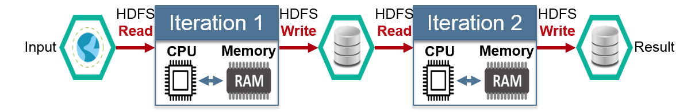
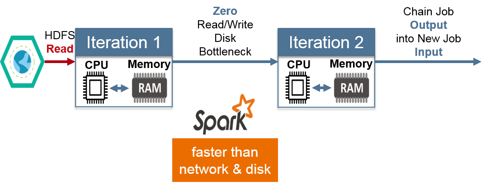
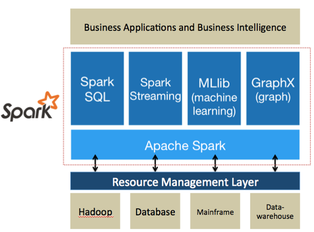
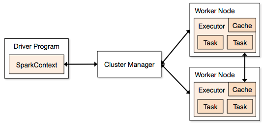
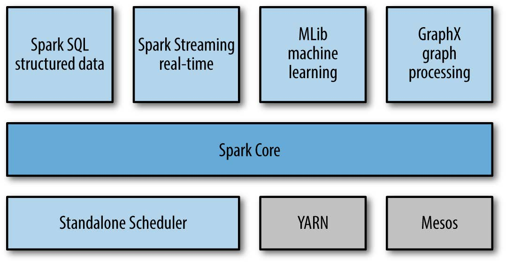
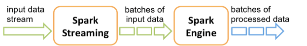
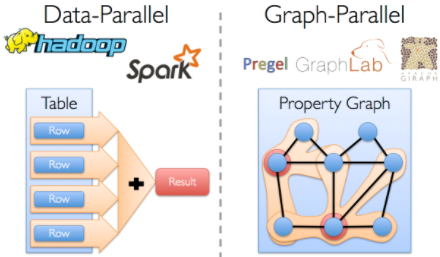

```{r setup, include=FALSE}
options(htmltools.dir.version = FALSE)
knitr::opts_chunk$set(eval=FALSE)
```

# Introduction to Apache Spark


- A new, faster, and more advanced engine for Big Data Analytics

  - predicted to overthrow Hadoop soon
  
  - New adopters tend to opt for Spark in their daily data processing activities.

--

- An attractive alternative to Hadoop
  
  - Reduce the processing time by up to 100x when run in memory
    
  - Can run as a standalone application or be deployed on top of Hadoop 
  
  - Supports multiple languages: Java, Python, Scala and R.

--

- Spark is a cluster computing system and not a data storage system.

  - Need an external source of data storage (local host filesystem, HDFS, NoSQL database)
  
---
# Spark versus MapReduce

- Traditional Approach: MapReduce jobs for complex jobs, interactive query, and online event-hub processing involves lots of (slow) disk I/O

```{r, out.width='75%', fig.align='center', echo=FALSE, eval=TRUE}

```

--

- Solution: Keep more data in-memory with a new distributed execution engine

```{r, out.width='75%', fig.align='center', echo=FALSE, eval=TRUE}

```

---
# SPARK - The Analytics Operating System
### "Enabling New Classes of Intelligent Applications Embedded with Analytics"

.pull-left[
- Spark unifies data, enabling real-time insights

- Spark processes and analyzes data from any data source

- Spark is complementary to Hadoop, but faster with in-memory performance

- Build models quickly. Iterate faster. Apply intelligence

]

.pull-right[

]
---
# Spark Application Architecture

- A Spark application is initiated from a driver program

```{r, out.width='75%', fig.align='center', echo=FALSE, eval=TRUE}

```

--

- Spark execution modes: Standalone with built-in cluster manager (FIFO scheduler), MESOS or YARN as the cluster manager
---
# Spark Application Architecture

```{r, out.width='50%', fig.align='center', echo=FALSE, eval=TRUE}

```

**Spark SQL**

- Provide for relational queries expressed in SQL, HiveQL and Scala

- Seamlessly mix SQL queries with Spark programs 

- DataFrame/Dataset provide a single interface for efficiently working with structured data including Apache Hive, Parquet and JSON files

- Standard connectivity through JDBC/ODBC (think of DBI package in R)

---
# Spark Streaming

- Started in 2012 with first stable release in Spark 0.9.0

--

- Discretized Stream (DStream) programming abstraction

  - Represented as a sequence of RDDs (micro-batches)
  
  - RDD: set of records for a specific time interval
  
  - Supports Scala, Java, and Python (with limitations)

--

- Fundamental architecture: batch processing of datasets

```{r, out.width='75%', fig.align='center', echo=FALSE, eval=TRUE}

```

---
# Spark Machine Learning

- Spark ML for machine learning library

--

- Provides common algorithm and utilities

  - Classification
  
  - Regression
  
  - Clustering
  
  - Collaborative filtering
  
  - Dimensionality reduction

--

- Basically spark ML provides you with a toolset to create "pipelines" of different machine learning related transformations on your data. 


---
# Spark ML

| Classification/Regression | Clustering | Feature Extractors |
|---------------------------|------------|--------------------|
| Logistic Regression | K-means | TF-IDF |
| Decision tree classifier | Gaussian mixture | Word2Vec
| Random forest | Latent Dirichlet Allocation | CountVectorizer |
| Gradient booted tree | Bisecting k-means | **Feature Transformers** |
| Mutilayer perceptron classifier | **Collaborative Filtering** | Tokenizer |
| One-vs-rest classifier | Alternating least squares | StopWordRemover |
| Linear regression | **Feature Selectors** | N-gram |
| Generalized linear reg. | VectorSlicer | Binarizer |
| Naive Bayes | RFormula | PCA |
| .... | .... | .... |

---
# Property Graphs


```{r, out.width='50%', fig.align='center', echo=FALSE, eval=TRUE}
knitr::include_graphics('images/graphx-2.png')
```

--

```{r, out.width='50%', fig.align='center', echo=FALSE, eval=TRUE}

```

---
# Spark GraphX


- Flexible Graphing

  - GraphX unifies ETL, exploratory analysis, and iterative graph computation

  - You can view the same data as both graphs and  collections, transform and join graphs with RDDs efficiently, and write custom iterative graph algorithms with the API

--

- GraphX is Apache Spark's API for graph and graph-parallel computation

  - [graphframes.github.io/](http://graphframes.github.io/)

  - [spark.apache.org/graphx/](https://spark.apache.org/graphx/)

- GraphX comes with a variety of graph algorithms

  - [ampcamp.berkeley.edu/big-data-mini-course/graph-analytics-with-graphx.html
](http://ampcamp.berkeley.edu/big-data-mini-course/graph-analytics-with-graphx.html
)

---
# Sparklyr: Using Spark with R

- **sparklyr** provides bindings to Spark's distributed *machine learning* library. 

- **sparklyr** allows you to access the machine learning routines provided by the `spark.ml` package. 

- Together with sparklyr's `dplyr` interface, you can easily create and tune machine learning workflows on Spark, orchestrated entirely within R. 

- Sparklyr provides three families of functions that you can use with Spark machine learning:

  - Machine learning algorithms for analyzing data (`ml_*`)
  
  - Feature transformers for manipulating individual features (`ft_*`)
  
  - Functions for manipulating Spark DataFrames (`sdf_*`)

---
# Sparklyr and dplyr as an R Interface for Spark ML

- Interactively manipulate Spark data using both `dplyr` and SQL (via `DBI`).

- Filter and aggregate Spark datasets then bring them into R for analysis and visualization.

- Orchestrate distributed machine learning from R using either `Spark ML` or `H2O SparkingWater` extension.

- Integrated support for establishing Spark connections and browsing Spark DataFrames within the RStudio IDE.

- IBM has incorporated `sparklyr` into its Data Science Experience as well.

---
# Analytic Workflow with `dplyr`

- Perform SQL queries through the sparklyr dplyr interface,

--

- Use the `sdf_*` and `ft_*` family of functions to generate new columns, or partition your data set,

--

- Choose an appropriate machine learning algorithm from the `ml_*` family of functions to model your data,

--

- Inspect the quality of your model fit, and use it to make predictions with new data.

--

- Collect the results for visualization and further analysis in R.

---
# Spark ML machine learning library
### Can be accessed from `sparklyr` through the `ml_*` set of functions:

| Function | Description |
|----------|-------------|
| `ml_kmeans` | K-Means clustering |
| `ml_linear_regression` | Linear Regression | 
| `ml_logistic_regression` | Logistic Regression |
| `ml_decision_tree` | Decision Trees |
| `ml_random_forest` | Random Forests |
| `ml_gradient_boosted_tree` | Gradient-Boosted Trees |
| `ml_pca` | Principal Component Analysis |
| `ml_naive_bayes` | Naive Bayes Classifier |
| ... | ... |

---
# Manipulating Data with `dplyr`

- `dplyr` is an R package for working with structured data both in and outside of R. dplyr makes data manipulation for R users easy, consistent, and performant. With dplyr as an interface to manipulating Spark DataFrames, you can:

  - Select, filter, and aggregate data
  
  - Use window functions (e.g. for sampling)
  
  - Perform joins on DataFrames
  
  - Collect data from Spark into R

--

- You can read data into Spark DataFrames using the following:

  - `spark_read_csv`	Reads a CSV file and provides a data source compatible with `dplyr`
  
  - `spark_read_json`	Reads a JSON file and provides a data source compatible with `dplyr`

---
# Install Standalone Spark

- Need to install Java JDK before Spark. [Link to download](https://www.oracle.com/technetwork/java/javase/downloads/jdk8-downloads-2133151.html)

- In the console of RStudio

```{r}
library(sparklyr)
spark_install(version = "2.1.0") #<<
```

--

- Create a Spark session

```{r}
conf <- spark_config()
conf$`sparklyr.shell.driver-memory` <- "16G"  
conf$spark.memory.fraction <- 0.8 
```

--

- Connect to Spark:

```{r}
sc <- spark_connect(master = "local", config = conf, version = "2.1.0")
```

