```{r setup, include=FALSE}
options(htmltools.dir.version = FALSE)
```

## Brief review 

- Data is ubiquitous, at the heart of *everything*.

- Data become cheaper to collect, easier to store, and faster to process.

- The power of big data is in the analysis you do and the actions you take. It is in neither the "big" part nor the "data" part.

--

**What is Big Data?**

--

- From McKinsey Global Institute in May 2011:

*“Big data refers to data sets whose size is beyond the ability of typical database software tools to capture, store, manage and analyze.”*

--

**Why is this definition not good enough?** 

---
# Characteristic of "Big Data" - Volume

According to [a report](https://www.emc.com/leadership/digital-universe/2014iview/executive-summary.htm) by IDC:

```{r, out.width='100%', fig.align='center', echo=FALSE}
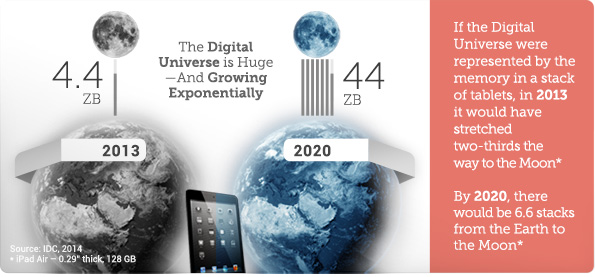
```
---
# Characteristic of "Big Data" - Volume

```{r, out.width='100%', fig.align='center', echo=FALSE}
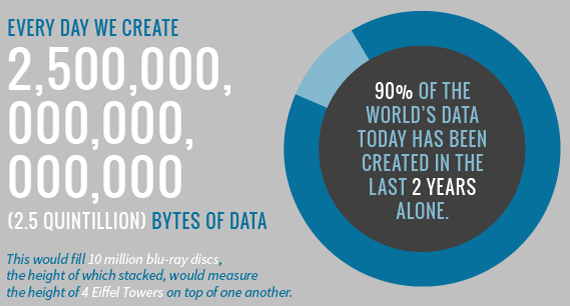
```
---
# Characteristic of "Big Data" - Volume

```{r, out.width='60%', fig.align='center', echo=FALSE}
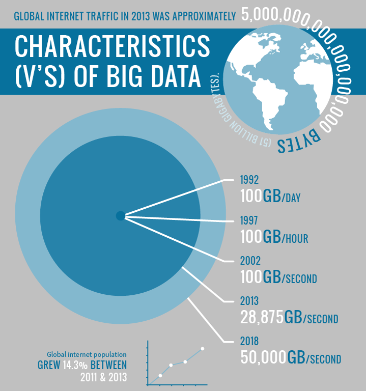
```
---
# Characteristic of "Big Data" - Volume

```{r, out.width='60%', fig.align='center', echo=FALSE}

```
---
# Characteristic of "Big Data" - Velocity

- Refers to the increasing speed at which data is created and the speed at which it can be processed, stored and analysed.

```{r, out.width='50%', fig.align='center', echo=FALSE}
knitr::include_graphics('images/big-data-velocity.png')
```

---
# Characteristic of "Big Data" - Velocity

- Current shift in Big Data Analytics from Volume to Velocity. (Discussed in a [Forbes article](https://www.forbes.com/sites/brentdykes/2017/06/28/big-data-forget-volume-and-variety-focus-on-velocity/))

--

- Late decisions lead to missing opportunities

--

- Example
  - *E-Promotions*: Based on your current location, your purchase history, what you like, we send promotions right now for store next to you.
  
--

  - *Healthcare monitoring*: sensors monitoring your activities and body, detect any abnormal measurements that require immediate intervention.

---
# Characteristic of "Big Data" - Variety

.pull-left[
- Various formats, types, and structures
- Text, numerical, images, audio, video, sequences, time series, social media data, multi-dim arrays, etc...
- Static data vs. streaming data 
- A single application can be generating/collecting many types of data  
]

.pull-right[
```{r, out.width='75%', fig.align='center', echo=FALSE}
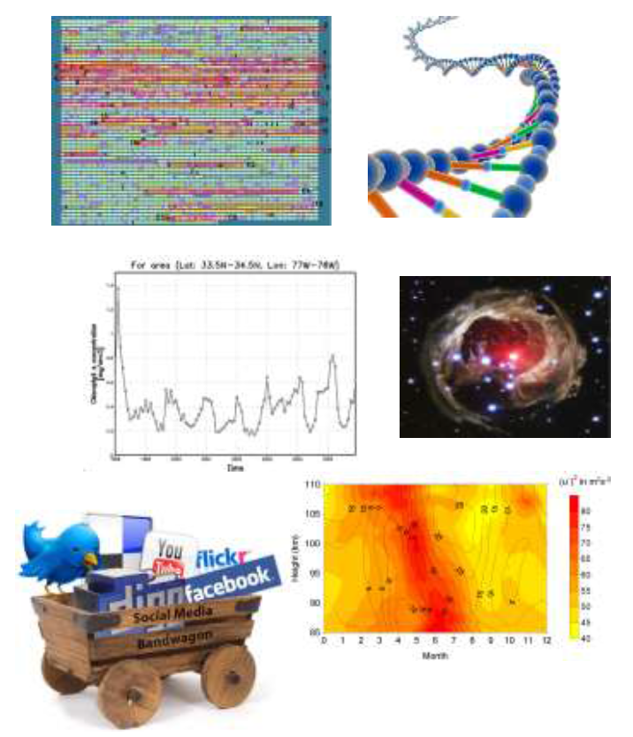
```
]

--

**90% of data generated is "unstructured" - including tweets, photos, customer purchase history and even customer service call logs.**

--

**To extract knowledge, all these types of data need to linked together**

---
# Types of Data

```{r, out.width='100%', fig.align='center', echo=FALSE}
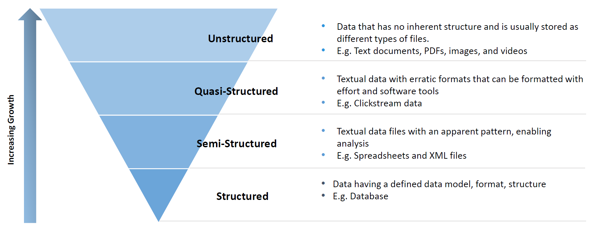
```


---
# Example of structured data

```{r, out.width='75%', fig.align='center', echo=FALSE}
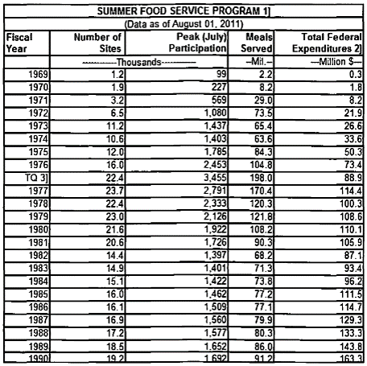
```

---
# Example of semi-structured data

```{r, out.width='75%', fig.align='center', echo=FALSE}

```

---
# Example of quasi-structured data

visiting 3 websites adds 3 URLs to user’s log files

```{r, out.width='75%', fig.align='center', echo=FALSE}
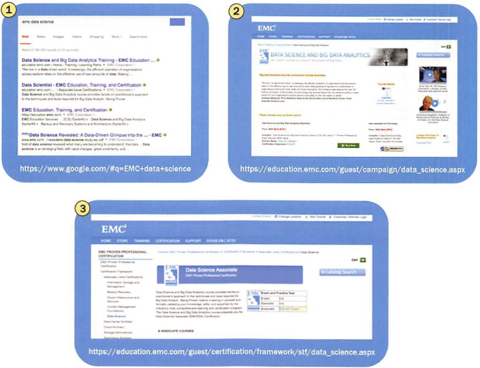
```

---
# Big Data Definition (3 V's)


**"Big Data"** is data whose scale, diversity, and complexity require new architecture, techniques, algorithms, and analytics to manage it and extract value and hidden knowledge from it...


```{r, out.width='75%', fig.align='center', echo=FALSE}
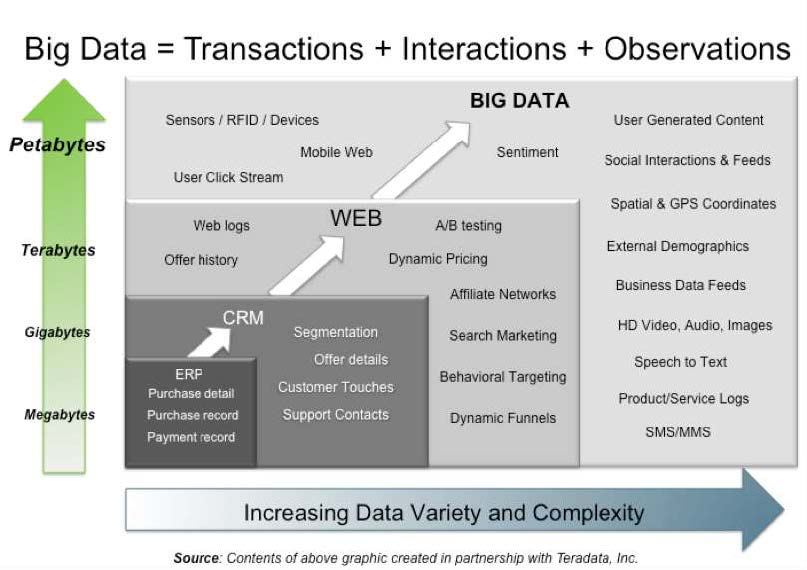
```


---
# Big Data (4V's)

```{r, out.width='100%', fig.align='center', echo=FALSE}
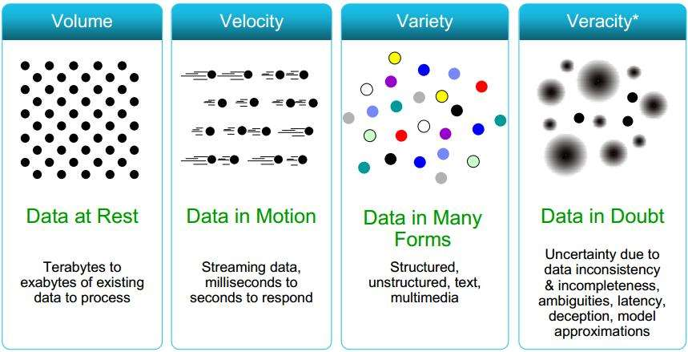
```
---
# Characteristic of "Big Data" - Veracity

**Fake data**

```{r, out.width='50%', fig.align='center', echo=FALSE}

```

---
# Characteristic of "Big Data" - Veracity

```{r, out.width='100%', fig.align='center', echo=FALSE}

```
---
# Big Data (6V's)

```{r, out.width='100%', fig.align='center', echo=FALSE}
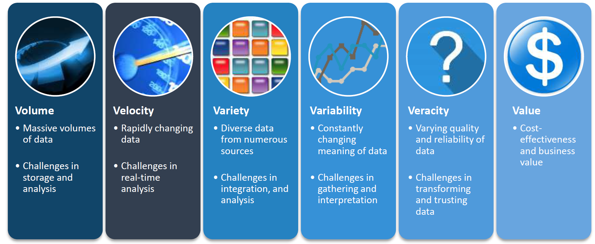
```
---
# Why Big Data is hard

- How store? Assuming 1TB bytes it takes 1000 computers to store a 1PB

--

- How to move? Assuming 10Gb network, it takes 2 hours to copy 1TB, or 83 days to copy a 1PB

--

- How to search? Assuming each record is 1KB and one machine can process
1000 records per sec, it needs 277CPU days to process a 1TB and 785 CPU
years to process a 1 PB

--

- How to process?
  – How to convert algorithms to work in large size
  – How to create new algorithms
---
# Why Big Data is hard

- System build of many computers

  - That handles lots of data

--

  - Running complex logic
  
--

- This pushes us to frontier of Distributed Systems and
Databases 

--

- More data does not mean there is a simple model

- Some models can be complex as the system

---
# Big Data Architecture

```{r, out.width='100%', fig.align='center', echo=FALSE}
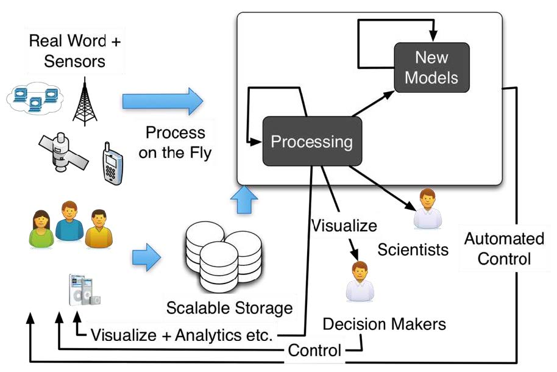
```
---
class: center

```{r, out.width='100%', fig.align='center', echo=FALSE}
knitr::include_graphics('images/Big-Data-Landscape-2017.png')
```

---
class: center

```{r, out.width='100%', fig.align='center', echo=FALSE}
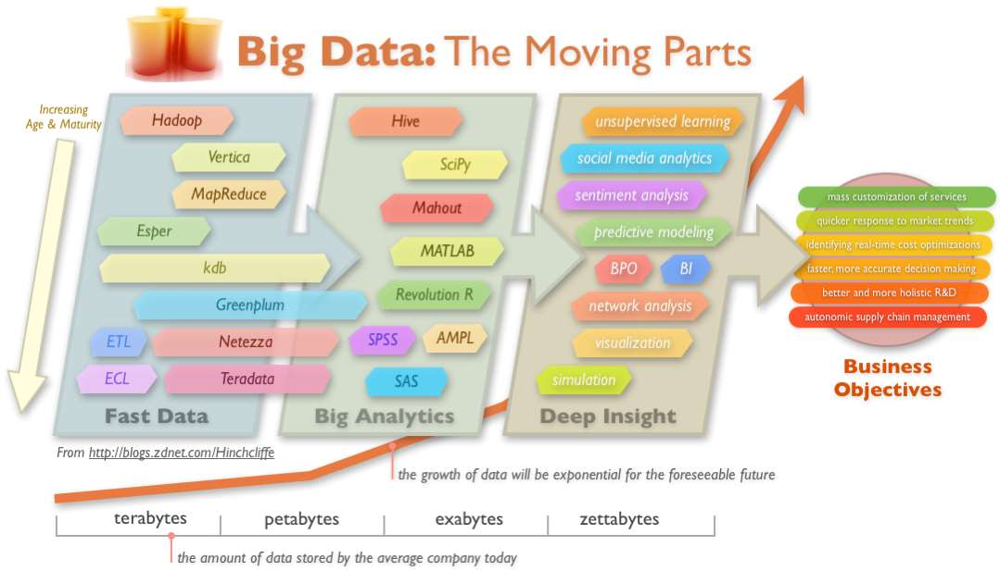
```

---
# Big Data Tools and Techniques

- Basic Data Manipulation and Analysis

  - Performing well-defined computations or asking well-defined questions ("queries")
  
- Data Mining

  - Looking for patterns in data
  
- Machine Learning

  - Using data to build models and make predictions
  
- Data Visualization

  - Graphical depiction of data 

- Data Collection and Preparation

---
# Basic Data Manipulation and Analysis

Performing well-defined computations or asking well-defined questions ("queries")

- Average January low temperature for each country over last 20 years

- Number of items over $100 bought by females between ages 20 and 30

- Frequency of specific medicine relieving specific symptoms

- The ten stocks whose price varied the most over the past year

--

Typical tools: Spreadsheets, Relational (SQL) database systems, "NoSQL"/scalable systems, Programming language with big-data support (Python, R)

---

# Data Mining

Looking for patterns in data

- Items X,Y,Z are bought together frequently
- People who like movie X also like movie Y
- Patients who respond well to medicines X and Y also respond well to medicine Z
- Students going to the same university are frequently online friends
- Wealthier people are moving from cities to suburbs

--

Tools: 
- Frequent item-sets
- Association rules
- Specialised techniques for networks, text, multimedia
---
# Machine Learning

Using data to build models and make predictions
- Customers who are women over age 20 are likely to respond to an advertisement
- Students with good grades are predicted to do well on the SAT
- The temperature of a city can be estimated as the average of its nearby cities, unless some of the cities are on the coast or in the mountains

Techniques: Regression, classification, clustering

---
# Data Collection and Preparation

The “dirty” secret of Big Data

- Extracting data from difficult sources
- Filling in missing values
- Removing suspicious data
- Making formats, encoding, and units consistent
- De-duplicating and matching

> **Data preparation often consumes 80% or more of the effort in a Big Data project**