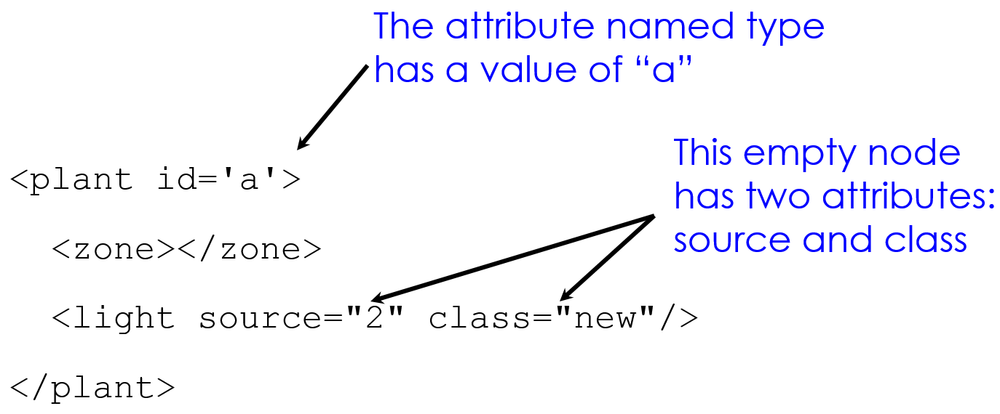

```{r setup, include=FALSE}
options(htmltools.dir.version = FALSE)
knitr::opts_chunk$set(eval=FALSE)
```

# HTTP - Hypertext Transfer Protocol
 
 - Created at CERN by Tim Berners-Lee in 1989 as part of the World Wide Web
 
 - Started as a simple **request-response protocol** used by web servers and browsers to access hypertext
 
 - Widely used to exchange data and to provide services:
 
  - Access webpage and submit forms
  
  - Common API *(Application Programming Interface)* to access data and services across the internet
  
- Foundation of modern REST APIs...

---
# Request - Response Protocol


---
# Request - Response Protocol


--

.pull-left[

**First line contains:**

`GET /majors/math/HTTP/1.1`

- a method: **GET** or **POST**

- a URL (Uniform Resource Locator) or path to the document

- the protocol and its version

]

--

.pull-right[

**Remaining Header Lines:**

- Key-value pairs

- Specify a [range of attributes](https://en.wikipedia.org/wiki/List_of_HTTP_header_fields)

**Optional Body**

- send extra parameters and data
]

---
# Request - Response Protocol


.pull-left[

]

.pull-right[

- First line contains status code

- Key- Value Pair lines
  
  - Data Properties
  
- Body

  - Returned data
  
  - HTML/JSON/Bytes
]

---
# In a Web Browser


---
# Request Types (Main Types)

**GET** - get information

- Parameters passed in URI (Uniform Resource Identifier) (limited to ~2000 characters)

  - `/app/user_info.json?username=mejoeyg&version=now`
  
  - Request body is typically ignored
  
  - Should not have side-effects (e.g., update user info)

  - Can be cached in on server, network, or in browser (bookmarks)
  
--

**POST** - send information

- Paramters passed in URI and BODY

- May and typically will have side-effects

- Often used with web forms

---
# Response Status Codes

- **100s Informational** - Communication continuing. more input expected from client or server

- **200s Success** - 200: General success

- **300s Redirection or Conditional Action** - requested URL is located somewhere else

- **400s Client Error**

  - 404 indicates the document was not found
  
  - 403 indicates that the server understood the request but refuses to authorize it
  
- **500s Interval Server Error or Broken Request** - error on the server side

---
# HTML/XML/ JSON

- Most services will exchange data in HTML, XML, or JSON

--

- All the formats are:

  - Descriptive: can maintain meta-data (i.e., info about the data)
  
  - Extensible: Organization can change and maintain compatibility

  - Human readable: Useful for debugging and provides a common interface
  
  - Machine readable: A wide range of technologies for parsing
  
---
# JSON: JavaScript Object Notation


---
class: middle, center

# Working with JSON with R
## A demo

---
# XML: eXtensible Markup Language 


---
# Syntax: Element / Node

- The basic unit of XML code is called an "element" or "node".

- Each node has a start tag and end tag


---
# Syntax: Nesting

- A node may cibtaub other nodes (children) in addition to plain text content.


-Indentation is not needed. It simply shows the nesting.

---
# Syntax: Empty Nodes

- Nodes may be empty

- Example:

```{r}
<plant>
  <zone></zone>
  <light/>
</plant>
```

- Both two inside nodes are empty. Both formats are exceptable.

---
# Syntax: Attributes

- Nodes may have attributes (and attribute values)


---
# Syntax: Comments

- Comments can appear any where

- Comments should be between `<!--` and `-->`

```{r}
<plant>
<!-- element with content -->
  <zone> 4 <!-- a second comment --> </zone>
  <light>Mostly shady</light>
</plant>
```

---
# Well-formed XML

- An element must have both an **open** and **closing** tag. However, if it is empty, then it can be of the form `<tagname/>`.

- Tag must be **properly nested:**

  - Bad example: `<plant><kind></plant></kind>`
  
- Tag names are case-sensitive

- No spaces are allowed between `<` and tag name.

- Tag names must begin with a letter and contain only alphanumeric characters.

---
# Well-formed XML

- All **attributes** must appear in quotes in:

```{r}
name = "value"
```

- Isolated markup characters must be specified via entity references. `<` is specifies by `&lt;` and `>` is specified by `&gt;`.

- All XML documents must have one root node that contains all the other nodes.

---
# DOM: Document Object Model

.pull-left[


]

.pull-right[

- Treat XML and HTML as a Tree

  - Fits XML and well formed HTML

- Visual containment: easy to see children

- Manipulated dynamically using JavaScript

  - HTML DOM and actual DOM the browser shows may differ 
]

---
# Tree terminology

- There is only one root (a.k.a document node) in the tree, and  all other nodes are contained within it.

- We think of these other nodes as descendants of the root node.  

- We use the language of a family tree to refer to relationships between nodes. 

  - parents, children, siblings, ancestors, descendants
  
- The terminal nodes in a tree are also known as leaf nodes.  Content always falls in a leaf node.

---
# HTML trees: a few additional "rules"

- Typically ordanized around `<div> </div>` elements

- Hyperlinks: `<a hred="uri"> Link Text </a>`

- The **id** attribute: unique key to identify an HTML node

  - Poorly written HTML: not always unique
  
- Older web forms will contain forms:
```{r}
<form action="/submit_comment.php" method="post">
  <input type="text" name="comment" value="blank" />
  <input type="submit" value="Submit" />
</form>
```

