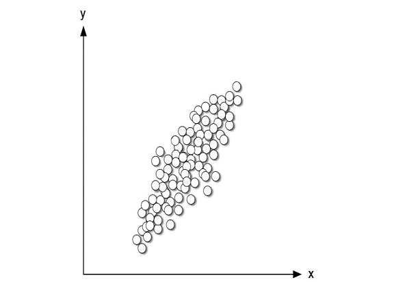
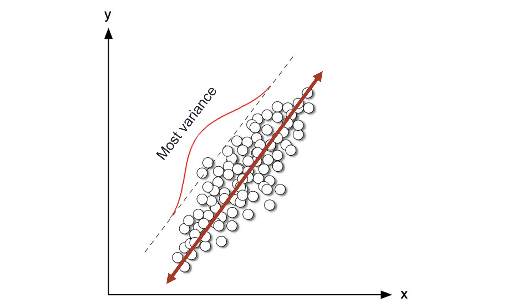
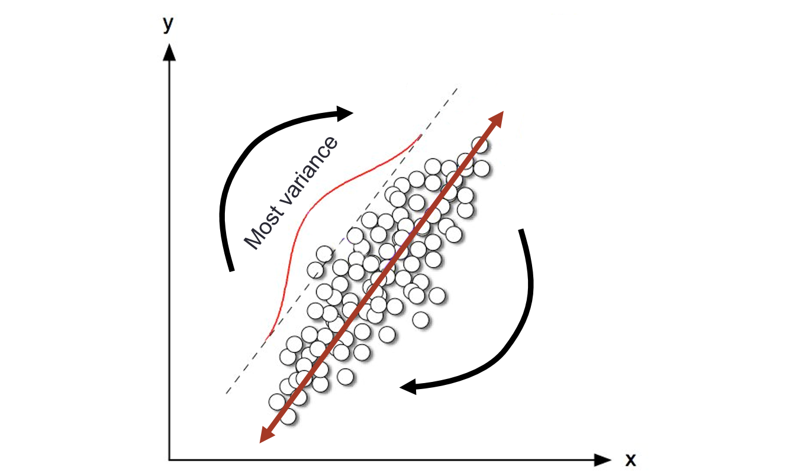
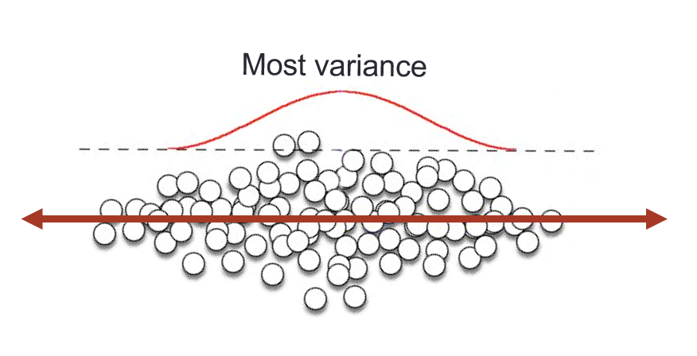
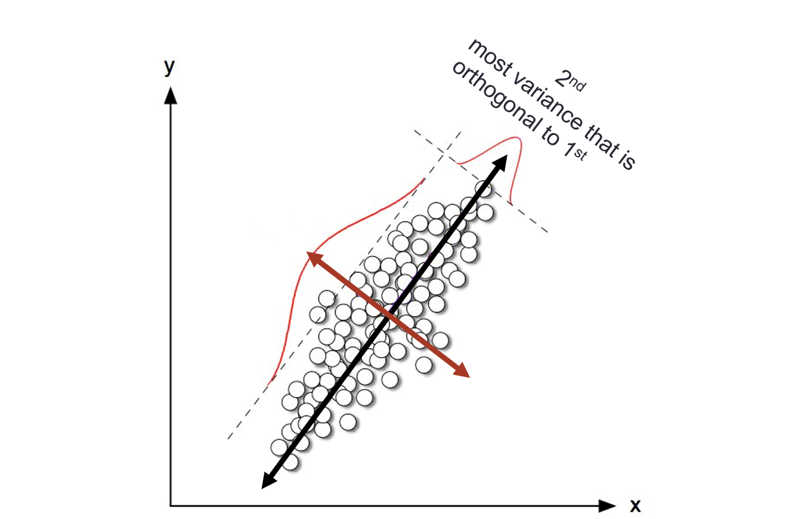

```{r setup, include=FALSE}
options(htmltools.dir.version = FALSE)
knitr::opts_chunk$set(eval=FALSE)
```

# Review/Recap

- One of the most common structures when doing text mining is **document-term matrix**. What is it?

--

  - Each row represents one document
  
  - Each column represents one term
  
  - Each value/entry typically contains the number of appearances of that term in that document

--

- Is the number of appearances the only metric? If not, what are others?

--

  - Binary indicator of the presence of that term in that document
  
  - TF-IDF
---
# Review/Recap

- What is TF-IDF and what does it represent?

--

  - tf-idf is intended to measure how important a word is to a document in a collection (or corpus) of documents.
  
- Now, what is an application of tf-idf and document vector?

--

  - To determine whether documents are similar. But, how?

--

- Cosine similarity measures the angle between document vectors.

  - What is the range of possible values?
  
--

  - What if we use tf-idf valued vector to represent document?
  
--

  - If the two documents are similar, which value of cosine similarity would you expect?

---
class: middle, center

# Demo on cosine similarity measure

---
# What is Dimensionality Reduction?

- Typically, a document is represented by a very high-dimensional vector, up to 10,000s coordinates (i.e., terms/words)

--

- High-dimensionality is not bounded in the context of text analysis, but a very common issue in most of the current data science project.

  - Your smartphone apps collect a lot of personal information about you.
  
  - Amazon collects data of what you buy, view, click, etc. on their site
  
  - Casinos keep a track of every move each customer makes
  
--

- The process of reducing the number of features/variables that would be used in the analysis is called **dimensionality reduction**.

---
# Why is Dimensionality Reduction required?

- Each observation (or document in the text analysis context) lives in high-dimensional space, but not all dimensions are equally interesting.

--

- Space required to store the data is reduced as the number of dimensions comes down

- Less dimensions lead to less computation/training time

--

- It helps in visualizing data. It is very difficult to visualize data in higher dimensions so reducing our space to 2D or 3D may allow us to plot and observe patterns more clearly

--

- Some algorithms/methods do not perform well when we have a large dimensions. So reducing these dimensions is requred when using the algorithms

---
# Common Dimensionality Reduction Techniques

- Dimensionality reduction techniques can be roughly grouped into two categories:

  1. Only keep the most relevant variables from the original dataset (feature selection)
  
  2. find a smaller set of new variables, each being a combination of the original variables, containing basically the same information as the variables
  
--

- **Missing Value Ratio:** remove variables that have too many missing values

  - Rule of thumb (but not set in stone): any variable with more than 50% missing value
  
  - Not applicable for text mining as there is no missing values for document-term matrices.
  
  - Techniques to impute missing value are discussed in STAT 493
  
---
# Common Dimensionality Reduction Techniques

- **Low variance Filter:** Variable with low variance tends to have very low impact on the target variable (i.e., response)

  - Extreme example: All the observations have the same value, say 1.
  
  - **Question:** When working with tf-idf, in which scenario we would experience something like the extreme example?

--

- But, in text mining, author detection takes advantage of rare appearance of rare words.

  - Example: anonymous NYT op-ed article  “I Am Part of the Resistance Inside the Trump Administration” by "senior official in the Trump administration"
  
  - Rare words: "malign behavior", "lodestar"
  
---
# Common Dimensionality Reduction Techniques

- **High Correlation Filter:** High correlation between two variables means they have similar trends and are likely to carry similar information. 

  - If the correlation coefficient crosses a certain threshold value, we can drop one of the variables
  
  - Dropping a variable is highly subjective and should always be done keeping the domain in mind
  
--
  
  - **As a general guideline, we should keep those variables which show a decent or high correlation with the target variable.**
  
--

  - Might be applicable in text analysis, depending on the goal of the project, e.g., topic modeling versus text classification
  
---
# Common Dimensionality Reduction Techniques

- **Forward Selection and Backward Elimination:** Very popular in modeling. 
  - Typically associated with linear regression or logistic regression models. 
  
  - Dropping/Adding variables one at a time depends on their effect on the response.
  
  - Covered in STAT 361/362

--

- **Factor Analysis:** Variability among high-dimensional observations correlates with a lower number of unobserved variables called **factor** (or *latent variables*)

  - Developed in psychology for measuring intelligence.
  
  - Text analysis equivalent technique is call **topic modeling**
  
---
# Principle Component Analysis


```{r, out.width='90%', fig.align='center', echo=FALSE, eval=TRUE}

```
---
# Principle Component Analysis

```{r, out.width='100%', fig.align='center', echo=FALSE, eval=TRUE}

```

---
# Mathematically

- The **1-st pricipal component** is the normalized linear combination of the feature:

$$Z_1 = \phi_{11}X_1 + \phi_{21}X_2 + \cdots + \phi_{p1}X_p$$
that has the largest variance

  - By *normalized*, we mean $\sum \phi_{k1}^2 = 1$.
  
- The elements $\phi_{11}, \phi_{21}, \ldots, \phi_{p1}$ are referred to as **loadings** of the 1-st principal component.

---
# Mathematically

If we center our data such that for each variable $j$:
$$\frac 1n \sum_{i = 1}^n X_{ij} = 0$$
then the loading vector is the solution to the following optimization problem:

$$\max_{\phi_{11}, \ldots, \phi{p1}} \frac 1n \sum_{i = 1}^n \left(\sum_{j=1}^p \phi_{j1}x_{ij}\right)^2 \mbox{ subject to }\sum_{j=1}^p\phi_{j1}^2 = 1$$

which can be solved using eigenvalue decomposition (typically covered in Linear Algebra)
---
# Principle Component Analysis

```{r, out.width='90%',  fig.align='center', echo=FALSE, eval=TRUE}

```

---
# Principle Component Analysis

```{r, out.width='100%', fig.align='center', echo=FALSE, eval=TRUE}

```

---
# Principle Component Analysis

```{r, out.width='65%', fig.align='center', echo=FALSE, eval=TRUE}

```

---
# Additional principal component

- The **2-nd principal component** is the normalized linear combination of the features:
$$Z_1 = \phi_{11}X_1 + \phi_{21}X_2 + \cdots + \phi_{p1}X_p$$
that has maximal variance out of all linear combinations that are **uncorrelated** with $Z_1$.

--

- Fact: Principal components are orthogonal. Intuitively, PCA rotates the coordinate axes according to trends in the data.

---
# Principle Components are orthogonal

```{r, out.width='100%', fig.align='center', echo=FALSE, eval=TRUE}

```


---
# Important details: scaling

- Variables are measured in different units, and consequently some of them have very different variance.

  - If we perform PCA on the unscaled variables, then the 1st principal loading vector will highly weight these variables
  
  - To avoid this, we typically scale each variable to have standard deviation of 1.
  
--

- If variables are not centered, the first principal component is (typically) the vector of the means

  - If an important trend direction is close to the mean vector, the PCA can't detect (Why?)
  
  - Centering is required most of the time.
  
---
# Important details: scaling

- In text analysis, tf-idf weights are on the same units. We only need to center the data.

  - Normalization by having the mean zero and the standard deviation 1 will undo the effect of IDF.

--

- **Uniqueness if the Principal Components**

  - Each principal component loading vector is unique, up to a sign flip.
  
  - Two different software will yield the same principal component loading vectors, although the signs of those loading vector may differ
  
  - $\mbox{Var}(-Z_k) = \mbox{Var}(Z_k)$
  
---
# Important details: Proportion of variation explained

- *Question:* how much of the information in a given data set is lost by projecting the observations onto the first few principal components?

  - *Rephrased:* how much of the **variance** in the data is not contained in the first few principal components?
  
--

- The total variance present in a data set (with centered variables)
$$\sum_{j=1}^p \mbox{Var}(X_j) = \sum_{j=1}^p \frac 1n \sum_{i=1}^n x_{ij}^2$$

---
# Important details: Proportion of variation explained

- Variance explained by the k-th principal component:

$$\mbox{Var}(Z_k) = \frac 1n \sum_{i=1}^n z_{ik}^2 = \frac 1n \sum_{i=1}^n  \left(\sum_{j=1}^p \phi_{jk}x_{ij}\right)^2$$

--

- Proportion of variance explained by the k-th principal component:

$$\frac{\sum_{i=1}^n  \left(\sum_{j=1}^p \phi_{jk}x_{ij}\right)^2}{\sum_{j=1}^p\sum_{i=1}^nx_{ij}^2}$$

- Keep a first few principal components that explain about 80% variance in the data set.