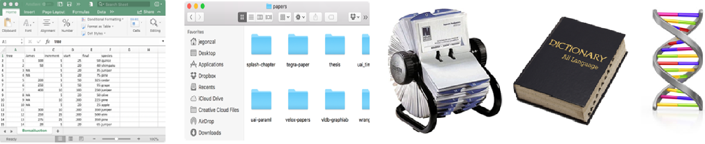
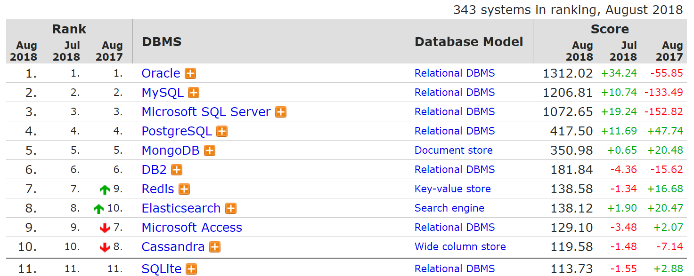
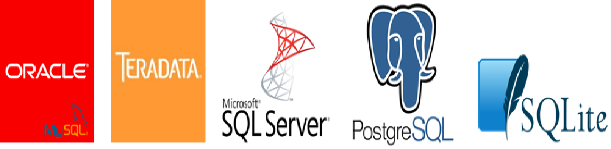
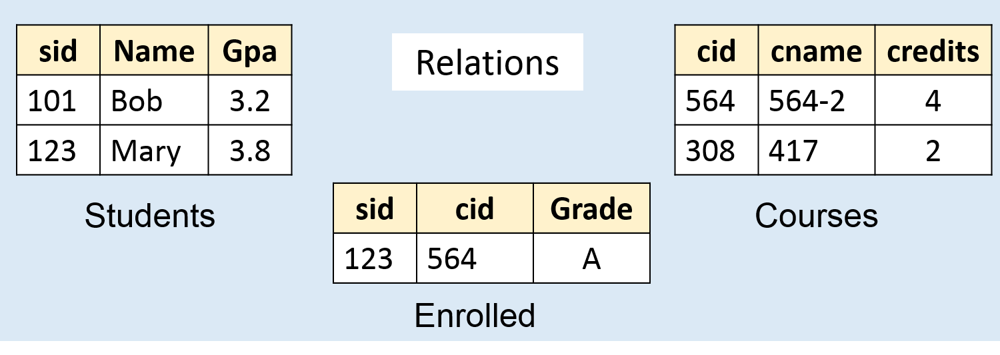
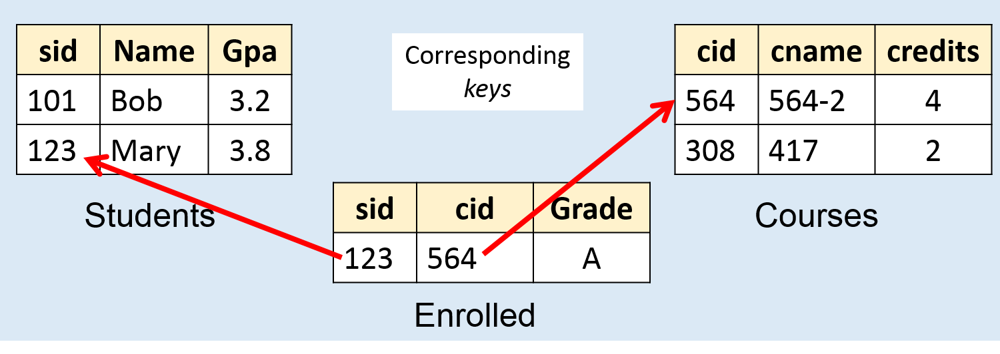
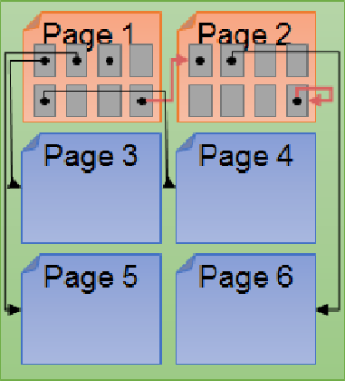
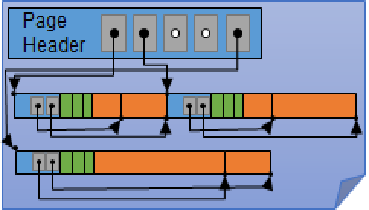
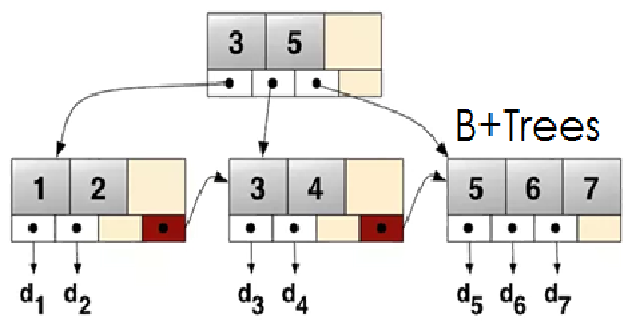

```{r setup, include=FALSE}
options(htmltools.dir.version = FALSE)
```

## Brief review 

- The world is increasingly **driven by data...**

--

- Big data is no longer referred to the *data volume*. 

  - Big data is "traditionally" defined with 3 V's: **Volume**, **Velocity**, and **Variety**.
  
  - Recently, more V's has been added to the definition: **Veracity**, **Variability** and **Value**.

--

- In the next few classes, we will learn **the basics** of how to use and manage data via *database*.

---
# What is a Database Management System (DBMS)?

- A large, organized, integrated collection of data

```{r, out.width='100%', fig.align='center', echo=FALSE}

```

--

- A **database management system (DBMS)** is a software system that **stores, manages,** and **facilitates access** to one or more databases.
---
# Database Management Systems

- **Data storage**

  - Provide **reliable storage** to survive system crashes and disk failures
  
  - Special data-structures to **improve performance**
  
--

- **Data management**

  - Configure how data is **logically organized** and **who has access**
  
  - Ensure data **consistency properties** (e.g., positive bank account values)

--

- **Facilitate access**

  - Enable **efficient access** to the data
  
  - Supports user defined **computation** (queries) over data
---
# Is *R/RStudio* a Database Management System?

--

- **Data Storage?**

--

  - R/RStudio doesn't store data, this is managed by the filesystem.
  
- **Data Management?**

--

  - R/RStudio does support changing the organization of data, but doesn't manage who can access the data
  
- **Facilitate Access?**

--

  - R/RStudio does support rich tools for computation over data
  
- R/RStudio is not generally considered a database management system but it often interacts with DBMSs

---
class: middle

# Discussion: Is your file-system a DBMS?

---
# Why shoud I use a DBMS?

--
.pull-left[ &nbsp; ]
.pull-right[ *Why can't I just have my CSV files?* ]

--

<br/>
<br/>

- DBMSs organize many related sources of information

--

- DBMSs enforce guarantees on the data

  - Can be used to **prevent data anomalies**
  
  - Ensure **safe concurrent operations** on data

--

- DBMSs can be **scalable**

  - Optimized to compute on data that **does not fit in memory**
  
  - **Parallel** computation and **optimized data structures**
  
--

- DBMSs **prevent data loss** from software/hardware **failures**.
---
# Common DBMS Systems

.pull-right[[https://db-engines.com/en/ranking](https://db-engines.com/en/ranking)]


```{r, out.width='100%', fig.align='center', echo=FALSE}

```

--

<br/>
<br/>

.center[**Relational** database management systems are widely used!]
---
# **Relational** Database Management Systems

- Relational databases are the traditional DBMS technology.

```{r, out.width='75%', fig.align='center', echo=FALSE}

```

--

- RDBMSs model a real-world *enterprise* via *Entity-Relationship model*

  - *Entities* (e.g., Students, Courses)
  
  - *Relationship* (e.g., Ray is enrolled in Stat 474)

---
# Data models

- A **data model** is a collection of concepts for describing data

  - The *relational model of data* is the most widely used model today
  
  - Main concept: the relation is essentially a table

--

- A **schema** is a description of a particular collection of data, **using the given data model**.

  - *Every relation* in a relational data model has a *schema* describing types, etc.
---
# Example

Consider building a course management system (**CMS**) - think of *Blackboard*

--

- Entities:

  - Students
  
  - Courses
  
  - Professors
  
--

- Relationships:

  - Who takes what
  
  - Who teaches what
---
# Modeling the CMS

**Logical Schema**

  - Students (sid: *string*, name: *string*, gpa: *float*)
  - Courses (cid: *string*, cname: *string*, credits: *int*)
  - Enrolled (sid: *string*, cid: *string*, grade: *string*)

--

```{r, out.width='75%', fig.align='center', echo=FALSE}

```

---
# Modeling the CMS

**Logical Schema**

  - Students (sid: *string*, name: *string*, gpa: *float*)
  - Courses (cid: *string*, cname: *string*, credits: *int*)
  - Enrolled (sid: *string*, cid: *string*, grade: *string*)


```{r, out.width='75%', fig.align='center', echo=FALSE}

```
---
# Relational Data **Abstraction**

--

.pull-left[
```{r, out.width='50%', fig.align='center', echo=FALSE}

```
]

--

.pull-right[

### Optimized Storage

```{r, out.width='60%', fig.align='center', echo=FALSE}

```
]

--

.center[ ### Optimized Data Structures ]

```{r, out.width='50%', fig.align='center', echo=FALSE}

```

---
# Data Independence

**Concept:** Applications do not need to worry about *how the data is structured and stored*.


--


.pull-left[ **Logical data independence:** protection from changes in the *logical* structure of the data]

.pull-right[ *should not need to ask: can we add a new entity or attribute without rewriting the appication?* ]

--


.pull-left[ <br>
**Physical data independence:** protection from changes in the *physical* layout change]

.pull-right[ <br>
*should not need to ask: which disks are the data stored on? Is the data indexed?* ]

--


.center[ <br>
<br>
**One of the most important reasons to use a DBMS** ]

---
# **Relational** Database Management Systems

- Relational databases are the traditional DBMS technology.

```{r, out.width='75%', fig.align='center', echo=FALSE}

```

- Logically organize data in **relations** (tables)

--

- Structured Query Language **(SQL)** to define, manipulate and compute on data.

--

  - A common language spoken by many data systems. Some variations and deviations from the standard...
  
  - Describes logical organization of data as well as computation on data.

---
class: center, middle

# In-class Activity
# First glimpse at SQL language

