```{r setup, include=FALSE}
options(htmltools.dir.version = FALSE)
knitr::opts_chunk$set(eval=FALSE)
```

# Data Mining and Machine Learning

- A very large collection of ML/Data mining is supervising methods

  - Big Idea: estimate the value of the response using some function of the predictors
  
  - "Supervising" means that we know the **true value** of the response, which we can use to check how accurate our models are
  
  - Many methods are covered in Stat 362.
  
--

- More relevant in text analysis, we **don't have a response**, things get a little messier...

  - Also relevent when working with large data sets.
  
---
# Unsupervised methods

- **Goal:** look for structures or patterns in the data **without** having a clear goal (i.e., predict $y$ from $X$).

- Example:

  - A online shopping site might try ti identify groups of shoppers with similar browsing and purchase histories.
  
--

  - A cancer researcher might look for subgroups among tissue samples from 100 breast cancer patients.
  
--

  - A search engine might priortize search results based on the click histories of other individuals with similar patterns
  
--

  - With a collection of documents, how should we divide into natural groups so that we can understand them separately?

--

- **Question:** What makes this kind of analysis challenging?
  
---
# Clustering

- **Big idea:** partition observations into distinct groups such that

  - observations **within** each group are similar to each other
  
  - observations in **different** groups are different from each other
  
- **What we need:** a clear idea of what it means for two or more observations to be *similar* or *different*

  - This is usually a domain-specific consideration that must be made based on additional knowledge of the data.

--

- **Question:** If I have two documents, how did I know that they are similar without reading both?
  
---
# Clustering

- **Goal:** partition the observations into a **pre-specified** number of groups

  - "partition" means that each observation is assigned to **exactly one** group.
  
  - (Future) In topic modeling, an document/article can be about two or more topics.
  
--

- *Brainstorming:* How should we define a cluster?

--
  
  - **Big idea:** good clustering = **within-cluster variation** is as small as possible

---
# Clustering - A bit of Math

- Performing clustering is equivalent to solve the problem

$$\min_{C_1, C_2, \ldots, C_K} \left\{\sum_{k=1}^K W(C_k)\right\}$$

where $C_1, C_2, \ldots, C_k$ are partitions of observations and $W(\cdot)$ measures the within-cluster variation

--

- Many ways to measure the within-cluster variation. 

  - Example: $W(C_k)$ is the average over the Euclidean distance between all pairs with cluster $C_k$. (Mathematical expression?)
  
--

- **Question:** Any concerns with the approach? What is the problem with this approach?

--

  - There are too many ways to partition observations into K pre-specified clusters.

---
# K-means algorithm

- A very simple algorithm can be shown to provide **a local optimum** (still a "pretty good" solution)

--

#### Algorithm:

1. Randomly assign a number, from 1 to $K$, to each of the observations. These served as initial cluster assignments for the observations.
  
2. Iterate until the cluster assignments stop changing:

  a. Compute the vector of the feature means for the observation in the k-th cluster (this is called the **centroid**)
  
  b. Assign each observation to the cluster whose centroid is closest (where "closest" is defined using Euclidean distance)

---
# K-means example - K = 3

```{r, out.width='50%', fig.align='center', echo=FALSE, eval=TRUE}
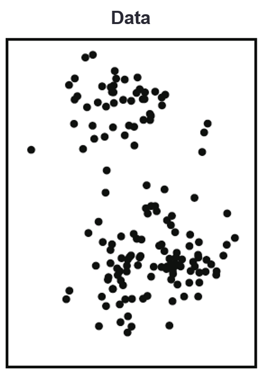
```

---
# K-means example - K = 3

```{r, out.width='50%', fig.align='center', echo=FALSE, eval=TRUE}
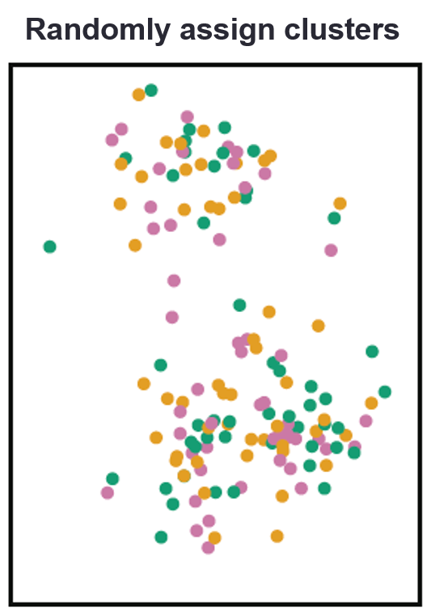
```

---
# K-means example - K = 3

```{r, out.width='50%', fig.align='center', echo=FALSE, eval=TRUE}
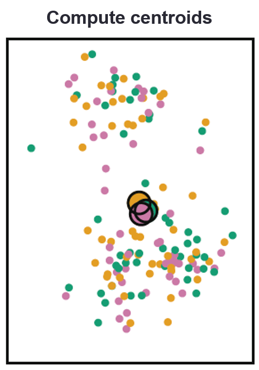
```

---
# K-means example - K = 3

```{r, out.width='50%', fig.align='center', echo=FALSE, eval=TRUE}
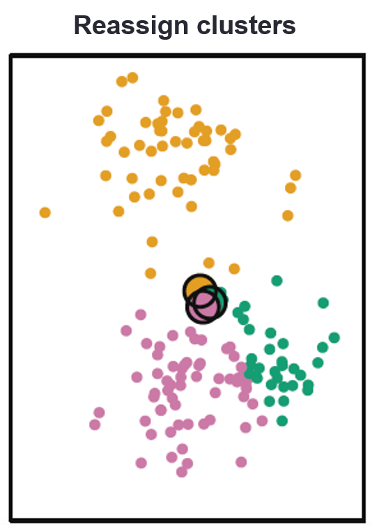
```

---
# K-means example - K = 3

```{r, out.width='50%', fig.align='center', echo=FALSE, eval=TRUE}
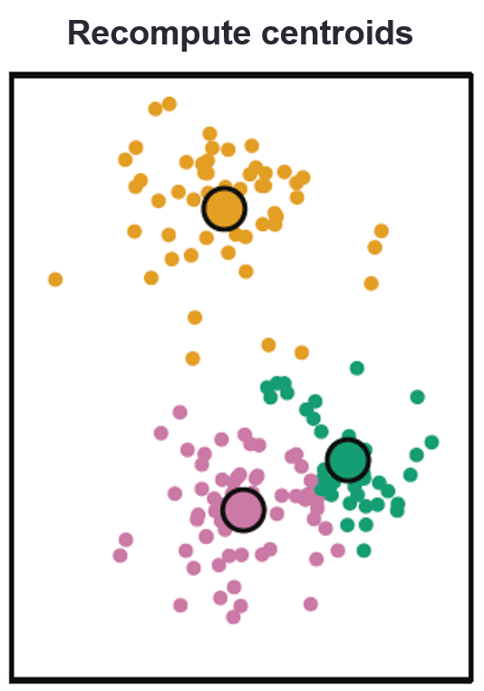
```

---
# K-means example - K = 3

```{r, out.width='50%', fig.align='center', echo=FALSE, eval=TRUE}
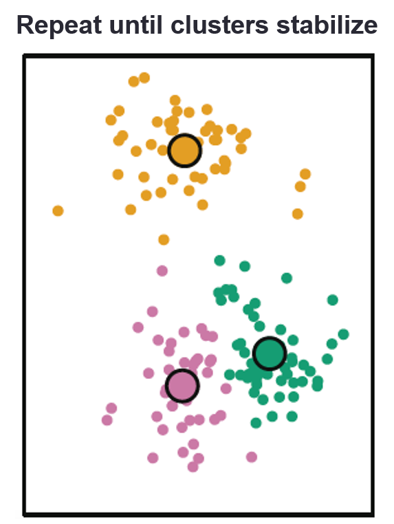
```

---
# K-means clustering

- **Question:** I claim that his process isguaranteed to decrease the cluster variation at each step - why?

--

  - The following identity is useful:
  
$$\frac{1}{|C_k|}\sum_{\mbox{all pairs } i, i'}\sum_{j=1}^p(x_{ij} - x_{i'j})^2 = 2\sum_{i \mbox { in } C_k} (x_{ij} - \overline{x}_{kj})^2$$

  - the **cluster means** are the constants that minimize the sum of squared deviations, so reassigning can only help.
  
--

- The K-means algorithm find a **local** rather than a global optimum.

- The results obtained will depend on the initial (random) assignment

- **In practice:** run the algorithm multiple times from different initial configurations to avaoid getting "stuck"

---
# Hierarchical clustering

.pull-left[
**Big Idea:** adapt tree-based methods to perform clustering **without** having to pre-specify # of clusters

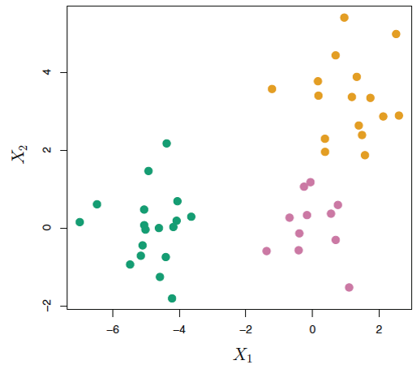
]

.pull-right[
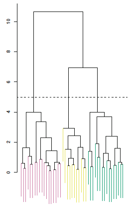
]
---
# Dengrograms

```{r, out.width='70%', fig.align='center', echo=FALSE, eval=TRUE}
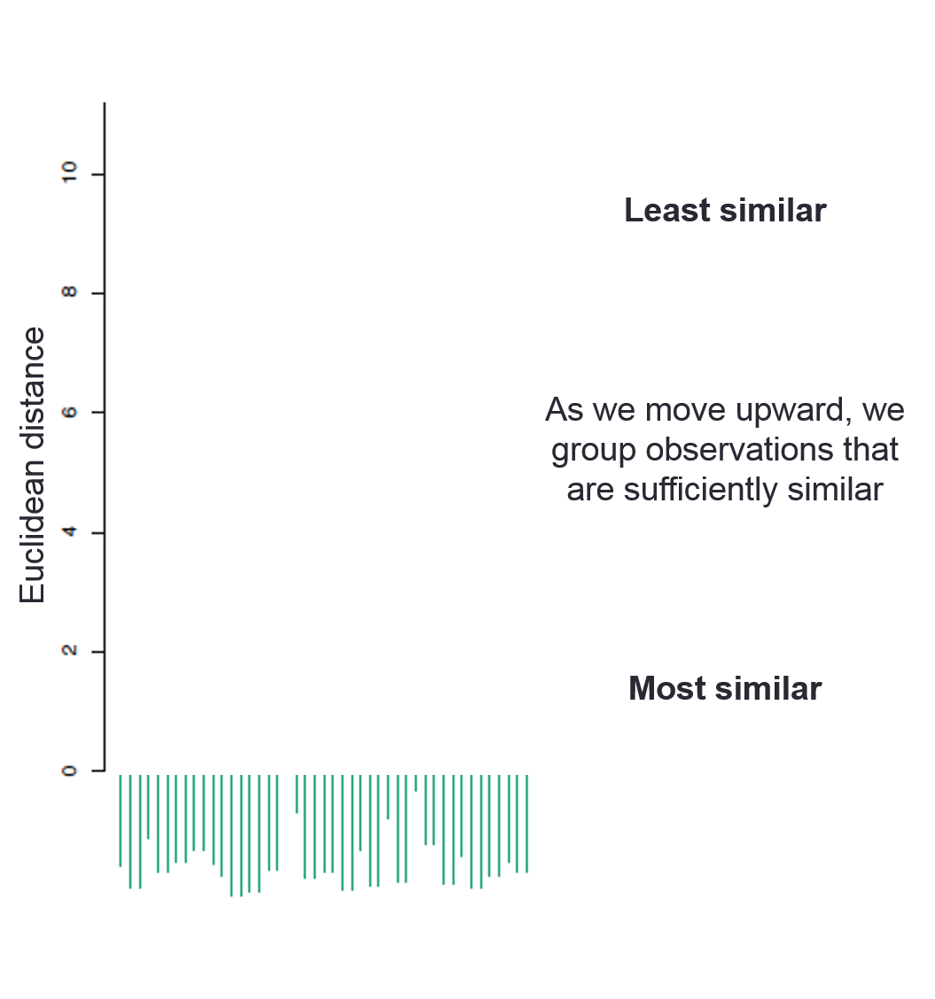
```

---
# Dengrograms

```{r, out.width='90%', fig.align='center', echo=FALSE, eval=TRUE}
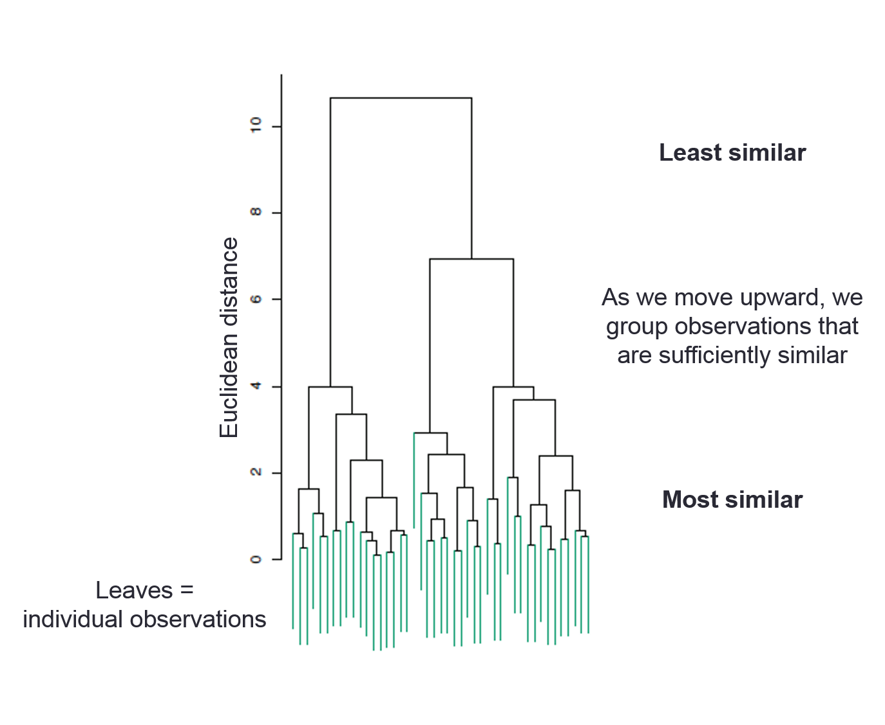
```


---
# Hierarchical clustering

- To go from a dendrogram to actual clusters, just cut!


```{r, out.width='100%', fig.align='center', echo=FALSE, eval=TRUE}
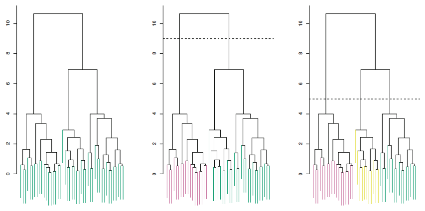
```

- The **height** of the cut serves the same role as the $K$ in k-means clustering: it controls the number of clusters.

---
# Building the dendrogram

- Let's start with a small data set:

| City | Annual rainfall (in) |
|------|----------------------|
| Boston | 43.77 |
| Cleveland | 39.14 |
| Portland | 39.14 |
| New Orleans | 62.45 |

--

```{r, out.width='40%', fig.align='center', echo=FALSE, eval=TRUE}
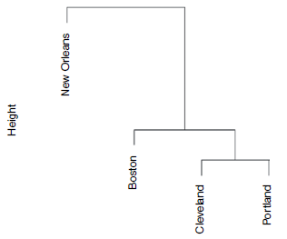
```


---
# Building the dendrogram

- Begin with $n$ observations and a measure of all the (n choose 2) pairwise distances. Treat each observation as its own cluster.

- For $i = n, n - 1, \ldots, 2$:

  - Examine all pairwise inter-cluster distances and identify the pair of clusters that are most similar.
  
  - Fuse these two clusters. The distances between these two clusters indicates the height in the dendrogram at which the fusion should be placed.
  
  - Compute the new pairwise inter-cluster distances.

--

- **Question:** What's missing?

--

  - How do we measure distance between clusters?
  
---
# Linkage types

- **Complete:** maximal inter-cluster distance (all pairs)

--

- **Single:** minimal inter-cluster distance (all pairs)

--

- **Average:** mean inter-cluster distance (all pairs)

--

- **Centroid:** distance between cluster means (inexpensive, but may result in problematic inversions)

--

.center[Average, complete = generally more **balanced**]
---
# Linkage types

```{r, out.width='100%', fig.align='center', echo=FALSE, eval=TRUE}
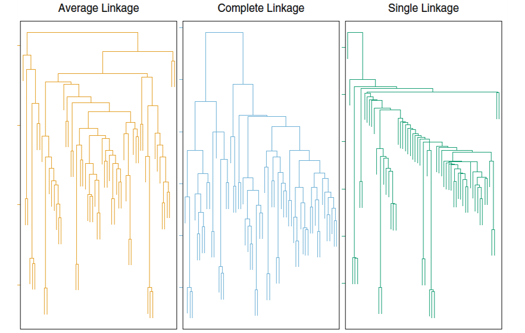
```

---
# Practical considerations: distance measure

- The choice of distance measure is very important, as it has a strong effect on the resulting clusters

  - Euclidean distance, Mahattan distance, many other distances,...

--

- Pay attention to the **type of data** being clustered and the **question** you are answering

- Example: online shopping. 

  - Data on whether customers purchased one specific item versus quantity of that item
  
  - Purchasing socks versus Macbook Air
  
--

- Might consider whether or not the variables should be scaled to have **standard deviation 1** before the similarity between the observations is measured.

  - If so, then each will be given **equal importance** when clustering is performed.
  
---
# Small decisions, big consequences

- Each of these decisions can have a **strong impact** on the results obtained.

- In practice, we usually try **several different choices**, and look for the one that seems the most useful.

- Any solution that exposes **some interesting aspect** of the data should be considered!
