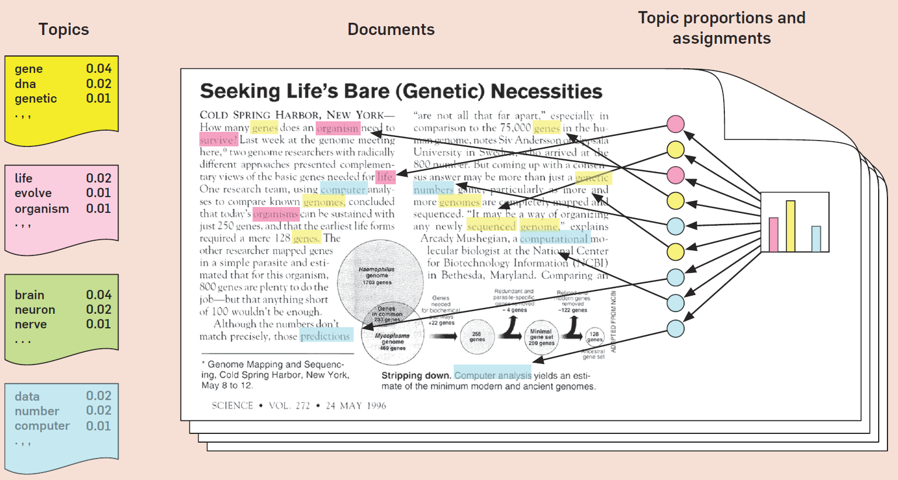

```{r setup, include=FALSE}
options(htmltools.dir.version = FALSE)
knitr::opts_chunk$set(eval=FALSE)
```

# Clustering Analysis - Review/Recap

- A common problem when analysing large datasets or collections of documents is to categorise them in some meaningful way.

- Unsupervised methods: discover the patterns, interesting things about all measurements in the dataset or the way to group similar observations together.

--

  - Principal Component Analysis
  
  - K-means and Hierarchical clustering

--

- Unsupervised problems are challenging. Why?

--

  - The exercise tends to be subjective
  
  - There is no simple goal for the analysis
  
  - No clear-cut approach to assess the quality of the resuts
---
# Clustering in text analysis

- Both k-means and hierarchical clustering are applicable in text analysis

--

- K-means method relies the Euclidean distance

  - Within-cluster variations are proportional to the total distance to the centroid.
  
  - Can apply the k-means on tf-idf valued document vectors
  
  - Variant of k-means: the spherical k-means use the cosine similarity measure as a distance metric.
  
--

- Hierarchical clustering uses the matrix of distances to create the dendrogram.

  - Just need to compute the matrix of pairwise cosine similarity among documents.
  
---
# Topic modeling

- **Goal:** to divide a collections of documents into natural groups so that we can understand them separately.

--

- Topic modeling is one of the unsupervised methods, similar to the clustering on numeric data.

  - Technically, a few algorithms can be used to perform topic modeling, but will focus on **Latent Dirichlet Allocation** (LDA)
  
--

- **So, what is "topic"?**

  - *Loose idea:* a grouping of words that are likely to appear in the same **context**.
  
  - A hidden structure that helps determine what words are likely to appear
  
  - Example: if "war" and "military" appear in a document, it won't be a surprise to find that "troops" appears later on. 
  
---
# Latent Dirichlet Allocation

- LDA treats each document as a mixture of topics, and each topic as a mixture of words

--

1. **Every document is a mixture of topics**. 

  - Each document contain words from several topics in particular proportions.
  
  - Example: in a two-topic model, we could say "Document 1 is 90% topic A and 10% topic B".
  
--

2. **Every topic is a mixture of words**.

  - A specific topic will have its own word distribution (i.e., **same across all documents**)
  
  - Example: Most common words about "politics" might be "president", "congress", and "government".
  
  - Topic about "entertaiment" might have "movies", "television", and "actor", but some words like "budget" might appear in both topics equally.
  
--

- LDA is a mathematical method for estimating both of these at the same time.
  
---
# Latent Dirichlet Allocation



---
# How LDA works?

- This is easy if all the tokens were labeled with topics (observed variables) 

  - Data: "**Apple iPads** *beat early holiday expectations*"
  
  - Just counting
  
--

- But we don't actually know the (hidden) topic assignments

  - Data: "Apple iPads beat early holiday expectations"
  
  - Use the **Expectation Maximization** method
  
---
# Expectation Maximization (EM) algorithm

- Algorithm:

  1. Randomly assign values for parameters (per-word-per-topic and per-topic-per-document probabilities)
  
  2. Based on those values, assign words to the corresponding topics
  
  3. Adjust the values of the parameters based on word-topic assignment in step 2.
  
  4. Repeat step 2 through 4 until stability (i.e., parameter values do change)
  
--

- Limitation: 
  
  - It can be very, very slow. 
  
  - It can only attain the local optimum.
  
---
class: middle, center

# Demo on clustering in text analysis
