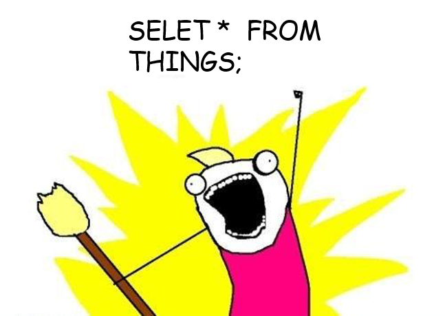

```{r setup, include=FALSE}
options(htmltools.dir.version = FALSE)
```

## Brief review 

-  A **database management system (DBMS)** is a software system that **stores, manages,** and **facilitates access** to one or more databases.

--

- The *relational model of data* is the most widely used model today, implemented in the **Relational Database Management Systems (RDBMS)** 

--

- **Data Independence** - Applications do not need to worry about *how the data is structured and stored*.

--

- Structured Query Language **(SQL)** to define, manipulate and compute on data. 

---
# SQL is a **Declarative** Language

- **Declarative:** "Say **what** you want, not **how** to get it."

--

  - *Declarative example:* I want a table with columns "x" and "y" constructed from tables "A" and "B" where the values in "y" are greater than 100.00.
  
--

  - *Imparative example:* : For each record in table "A" find the corresponding record in table "B" then drop the records where "y" is less than or equal to 100 then return the "x" and "y" values.
  
--

- **Advantages** of declarative programming:

  - Enable the system to find the best way to achieve the result.
  
  - Often more compact and easier to learn for non-programmers.
  
--

- **Challenges** of declarative programming

  - System performance depends heavily on automatic optimization
  - Limited language
---
# SQL is a ...

- Data Definition Language (DDL)

  - Define relational *schemata*
  
  - Create / alter / delete tables and their attributes
  
--

- Data Manipulation Language (DML)

  - Insert / delete / modify tuples in tables
  
  - Query one or more tables

--

.pull-left[
CAPITALIZATION IS *optional* BUT ...

DATABASE PEOPLE PREFER TO YELL
]

.pull-right[



]
---
# Tables in SQL

**Product**

| PName | Price | Manufacturer |
|-------|-------|--------------|
| Gizmo | $19.99 | Gizmo Works |
| Powergizmo | $29.99 | Gizmo Works |
| SingleTouch | $149.99 | Canon |
| MultiTouch | $203.99 | Hitachi |

--

  - A **relation** or **table** is a unordered list of tuples having the attributes specified by the schema.
  
--

  - **Unordered list** means that duplicated rows are allowed
  
  - **Unordered list** means that there is no order in the table. There is no `next()` function to inquire the next row in the table.
---
# Tables in SQL

**Product**

| PName | Price | **Manufacturer** |
|-------|-------|--------------|
| Gizmo | $19.99 | **Gizmo Works** |
| Powergizmo | $29.99 | **Gizmo Works** |
| SingleTouch | $149.99 | **Canon** |
| MultiTouch | $203.99 | **Hitachi** |

--

- An **attribute** (or **column**) is a typed data entry present in each tuple in the relation

--

- *Note:* Attributes must have an **atomic** type in standard SQL, i.e., not a list, set, etc.
---
# Tables in SQL

**Product**

| PName | Price | Manufacturer |
|-------|-------|--------------|
| Gizmo | $19.99 | Gizmo Works |
| Powergizmo | $29.99 | Gizmo Works |
| SingleTouch | $149.99 | Canon |
| **MultiTouch** | **$203.99** | **Hitachi** |

--

- A **tuple** or **row** is a single entry in the table having the attributes specified by the schema

- Also referred to sometimes as a **record**
---
# Data Types in SQL

- Atomic types:

  - Characters: `CHAR(20)`, `VARCHAR(20)`
  - Numbers: `INT`, `BIGINT`, `SMALLINT`, `FLOAT`, `BOOLEAN`
  - Others: `MONEY`, `DATETIME`, ...

--

- There are variation/deviation among different SQL systems. The above list are available for SQLite.

--

- Every attribute must have an atomic type

  - Hence tables are flat
---
# Table Schemas

- The **schema** of a table name, its attributes, and their types:

```
Product(Pname: string, Price: float, Category: string, Manufacturer: string)
```

--

- A **key** is an attribute whose values are unique;
  
  - In the example, `Pname` and ` Manafacturer` are keys  

---
# Key constraints


- A **key** is a **minimal subset of attributes** that acts as a unique identifier for tuples in a relation

--

- A key is an implicit constraint on which tuples can be in the relation
  
  - i.e., if two tuples agree on the values of the key, then they must be the same tuple!
  
--

**Discussion:**

.center[
```
Students(sid:string, name:string, gpa: float)

```
]

1. Which would you select as a key?

--

2. Is a key always guaranteed to exists?

--

3. Can we have more than one key?

---
# NULL and NOT NULL

- To say "don't know the value", we use `NULL`

  - We can think `NULL` as `NA` in R.
  
  - NULL has (sometimes painful) semantics.
  
--

.center[
```
Students(sid:string, name:string, gpa: float)

```
]

| sid | name | gpa |
|-----|------|-----|
| 123 | Bob  | 3.9 |
| 143 | Jim  | NULL|

- Say, Jim just enrolled in this first class

--

- In SQL, we may contrain a column to be NOT NULL, e.g., "name" or "sid" in this table.

---
# General Constraints

- We can actually sepcify arbitrary assertions

  - Example: There cannot be 25 people in the STAT 474 course
  
--

- In practice, we don't specify many such constraints. Why?

--

  - **Performance!!**
  
<br>
<br>

.center[
*Whenever we (i.e., database people) do something ugly* 

*(or avoid doing something convenient)* 

*it's for the sake of performance*
]
---
# Schema Information

- Schema and constraints are how databases understand the semantics (meaning) of data

- They are also useful for optimization (either storage or performance or both)

- SQL supports general constraints:

  - Keys and foreign keys are most important
  
--

| Primary key | Foreign key | 
|-------------|-------------|
| Primary key uniquely identify a record in the table | Foreign key in the table is a primary key in another table |
| Primary key can't accept NULL | Foreign key can accept NULL |
| Only one primary key in a table | can have more than one foreign keys in a table |

---
class: center, middle

# LAB 1 - part 1
## Create a schema for a table
---
# SQL Query

Basic form (there are manu, many more bells and whistles)

<br>

```
SELECT <attribute>
FROM <one or more relations>
WHERE <conditions>
```

<br>

Call this a **SFW** query
---
# Simple SQL query: Selection

**Selection** is the operation of filtering a relation's tuples on some condition

| PName | Price | Category | Manufacturer |
|-------|-------|----------|--------------|
| Gizmo | $19.99 | Gadgets | Gizmo Works |
| Powergizmo | $29.99 | Gadgets | Gizmo Works |
| SingleTouch | $149.99 | Photography |Canon |
| MultiTouch | $203.99 | Household |Hitachi |

--

```
SELECT *
FROM Product
WHERE Category = 'Gadgets'
```

--

| PName | Price | Category | Manufacturer |
|-------|-------|----------|--------------|
| Gizmo | $19.99 | Gadgets | Gizmo Works |
| Powergizmo | $29.99 | Gadgets | Gizmo Works |

---
# Simple SQL query: Projection

**Projection** is the operation of producing an output table with tuples that have a subset of their prior attributes

| PName | Price | Category | Manufacturer |
|-------|-------|----------|--------------|
| Gizmo | $19.99 | Gadgets | Gizmo Works |
| Powergizmo | $29.99 | Gadgets | Gizmo Works |
| SingleTouch | $149.99 | Photography |Canon |
| MultiTouch | $203.99 | Household |Hitachi |

--

```
SELECT PName, Price, Manufacturer
FROM Product
WHERE Category = 'Gadgets'
```

--

| PName | Price |  Manufacturer |
|-------|-------|---------------|
| Gizmo | $19.99 | Gizmo Works |
| Powergizmo | $29.99 | Gizmo Works |

---
# A few Details

- SQL **commands** are case insensitive:

  - Same: SELECT, Select, select
  
  - Same: Product, product
  
--

- **Values** are **not:**

  - *Different:* 'Evansville', 'evansville'
  
- Use single quotes for constants:

  - 'abc' - yes
  
  - "abc" - no
---
# LIKE: Simple String Pattern Matching

```
SELECT *
FROM   Products
WHERE  PName LIKE ‘%gizmo%’
```

--

- The syntax: `s LIKE p`: pattern matching on strings

- `p` may contain two special symbols:

  - % = any sequence of characters
  - _ = any single character
  
---
# DISTINCT: Eliminating Duplicates

.pull-left[
```
SELECT DISTINCT Category
FROM Product
```

<br>
<br>

versus

<br>

```
SELECT Category
FROM Product
```

]

--

.pull-right[

| Category |
|----------|
| Gadgets |
| Photography |
| Household |

<br>

| Category |
|----------|
| Gadgets |
| Gadgets |
| Photography |
| Household |

]

---
# ORDER BY: Sorting the Results

```
SELECT   PName, Price, Manufacturer
FROM     Product
WHERE    Category=‘gizmo’ AND Price > 50
ORDER BY Price, PName
```

--

- Ties are broken by the second attribute on the ORDER BY list, etc.

- Ordering is ascending, unless you specify the DESC keyword.
