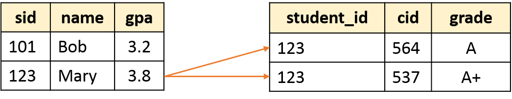

```{r setup, include=FALSE}
options(htmltools.dir.version = FALSE)
library(DBI)
library(RSQLite)
con <- dbConnect(SQLite(), "dataset_1.db")
```

# Creating Tables

- Example: Create the table `product` as below

| PName | Price | Category | Manufacturer |
|-------|-------|----------|--------------|
| Gizmo | $19.99 | Gadgets | Gizmo Works |
| Powergizmo | $29.99 | Gadgets | Gizmo Works |
| SingleTouch | $149.99 | Photography |Canon |
| MultiTouch | $203.99 | Household |Hitachi |

--

```
CREATE TABLE product(
pname        VARCHAR PRIMARY KEY, -- name of the product
price        MONEY,               -- price of the product
category     VARCHAR,             -- category
manufacturer VARCHAR NOT NULL     -- manufacturer
);
```

--

- Attributes (or columns) have **names** and **types**

- **Semicolon** at the end of command 

- **Comment in SQL:** anything after `--` to the end of the line.

---
# Creating Tables (con't)

```
CREATE TABLE product(
pname        VARCHAR PRIMARY KEY,        -- name of the product
price        MONEY CHECK (price < 1000), -- price of the product
category     VARCHAR,                    -- category
manufacturer VARCHAR NOT NULL            -- manufacturer
);
```

- Impose integrity constraints with the keyword **CHECK ( <condition> )**

--

- primary key and foreign keys can be declared separately

```
CREATE TABLE product(
pname        VARCHAR,        -- name of the product
price        MONEY CHECK (price < 1000), -- price of the product
category     VARCHAR,                    -- category
manufacturer VARCHAR NOT NULL,            -- manufacturer
PRIMARY KEY (pname)
);
```
---
# Foreign Key contraints

- Suppose we have the following schema:

```
Students(sid: string, name: string, gpa: float)
Enrolled(student_id: string, cid: string, grade: string)
```

--

- And we want to impose that "Only bona fide students may enroll in courses", (i.e., a student must appear in the Students table to enroll in a class)



- `student_id` alone is not a key - what is?

--

  - We say that `student_id` is a **foreign key** that refers to `students`.
---
# Declaring Foreign Keys

```
Students(sid: string, name: string, gpa: float)
Enrolled(student_id: string, cid: string, grade: string)

CREATE TABLE Enrolled(
	student_id CHAR(20),
	cid		 CHAR(20),
	grade	 CHAR(10),
	PRIMARY KEY (student_id, cid),
	FOREIGN KEY (student_id) REFERENCES Students(sid)
);
```

---
# Inserting Records into a Table

```
INSERT INTO students 
VALUES ('101', 'Bob', 3.2),
       ('123', 'Mary', 3.8);
```

--

- Fields must be entered in order (specified by the schema)

- Comma between records

- Must use the single quote

--

- **Question:** Does the order matter?
---
# Deleting and Modifying Records

<br>

Records are deleted by specifying a condition

```
DELETE FROM students
WHERE LOWER(name) = 'bob';
```

- `LOWER( )` in SQL in a string function, very useful when dealing with string format

--

<br>

Modifying records

```
UPDATE students
SET gpa = 1 + gpa
WHERE sid = '123';
```

- Notice that there is no way to modify records by location.

---
# Deleting and Modifying Records

.pull-left[
What is wrong with the following

```
UPDATE students
SET gpa = 1 + gpa
WHERE sid = '123';
```

```
CREATE TABLE students(    
  sid CHAR(20)
	name CHAR(20),     
	gpa FLOAT CHECK (gpa >= 0.0 and gpa <= 4.0));
```

]

.pull-right[

| sid | name | gpa |
|-----|------|-----|
| 101 | Bob  | 3.2 |
| 123 | Mary | 3.8 |

]

--

<br>
<br>

.center[**Update would violate Integrity Constraints**]


---
# Foreign Keys and updating operations


- What if we insert a tuple into `Enrolled`, but no corresponding student?

--

  - `INSERT` is rejected (foreign keys are **constraints**)
  
--

- What if we delete a student?

--

  1. Disallow the delete
  
  2. Remove all of the courses for that student
  
  3. SQL allows a NULL
---
# Keys and Foreign keys

**Product**

| PName | Price | Category | Manufacturer |
|-------|-------|----------|--------------|
| Gizmo | $19.99 | Gadgets | Gizmo Works |
| Powergizmo | $29.99 | Gadgets | Gizmo Works |
| SingleTouch | $149.99 | Photography |Canon |
| MultiTouch | $203.99 | Household |Hitachi |

--

**Company**

| CName | StockPrice | Country |
|-------|------------|---------|
| Gizmo Works | 25 | USA |
| Canon | 65 | Japan |
| Hitachi | 15 | Japan |

--

**Question:** What is a foreign key vs. a key here?

---
# SQL DML - Basic Single-Table Queries

<br>
<br>

```
SELECT [DISTINCT] <column expression list>
    FROM <single table>
[WHERE <condition>]
[GROUP BY <column list>
    [HAVING <condition>] 
[ORDER BY <column list>];
```

- Elements of the basic select statement

- [Square brackets] are optional expressions

--

- SFW queries - the simplest version

--
  
  1. What is SFW query?
  
  2. What does a SFW query produce?
---
# In-class activity

Go to the website [http://sqlfiddle.com/#!7/befe3](http://sqlfiddle.com/#!7/befe3)

- Build the schema

- Create SQL queries to:

  1. Find the name and GPA for all CS students
  
--

  2. Find the department where students come from

--

  3. Print the list of CS students sorted by GPA (best student on top) and name (alphabetical order).

---
# Aggregates


.pull-left[

```{r, eval=FALSE}
SELECT AVG(gpa) #<<
    FROM students
WHERE dept = 'CS';
```

]

.pull-right[


| avg |
|-----|
| 3.4 |

]

--

<br>

- Before producing output, compute a summary statistic

  - Aggregates include: `SUM, COUNT, MAX, MIN, ...`
  
  - *Special case:* `COUNT(*)` to query the number of rows
  
  - Depending on the DBMS, more functions might be available.
  
--

- Produces 1 row of output, **but still a table**

  - In general, all output of SQL queries are in table format (similar to `tidyverse` in R)

--

- *Note:* can use `DISTINCT` inside the aggregate functions

  - Example: `SELECT COUNT(DISTINCT name) FROM students;`
---
# `GROUP BY`

.pull-left[

```{r, eval=F}
SELECT dept, AVG(gpa) 
    FROM students
GROUP BY dept; #<<
```

]

.pull-right[

| dept | avg |
|------|-----|
| CS | 3.4 |
| BUSINESS | 4.0 |
| DATASCI | 4.0 |

]

--

- Partition table into groups with same `GROUP BY` column values

  - `GROUP BY` takes a list of columns
  
- Produce an aggregate result per group

--

**Questions:** What output do you expect?

1. `SELECT AVG(gpa) FROM students GROUP BY dept;`

--

2. `SELECT name, AVG(gpa) FROM students GROUP BY dept;`
---
###  What if we wanted to only consider departments that have greater than two students?

.pull-left[

```
SELECT dept, AVG(gpa)
   FROM students
GROUP BY dept;
```
]

--

.pull-right[

```{r, eval=F}
SELECT dept, AVG(gpa)
   FROM students
WHERE COUNT(*) > 2 #<<
GROUP BY dept;
```
]

--

- `WHERE` clause is applied before `GROUP BY`
  
  - You cannot have aggregation functions in the `WHERE` clause

---
# HAVING

.pull-left[

```{r, eval=F}
SELECT dept, AVG(gpa)
  FROM students
GROUP BY dept
  HAVING COUNT(*) > 2; #<<
```
]

--

.pull-right[

| dept | avg |
|------|-----|
| CS | 3.4 |
| BUSINESS | 4.0 |

]

--

- The `HAVING` condition is applied **after** *grouping* and *aggregation*

  - Can contain anything that could go in the `SELECT` list
  
--

- `HAVING` can only be used in aggregate queries.
---
# Conceptual SQL Evaluation


--

```
SELECT dept, AVG(gpa), COUNT(*)
  FROM Students
 WHERE gender = 'F'
 GROUP BY dept 
HAVING COUNT(*) > 2
 ORDER BY dept;
 ```
 
**What is the output?**

