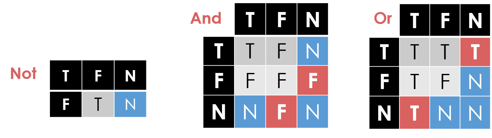
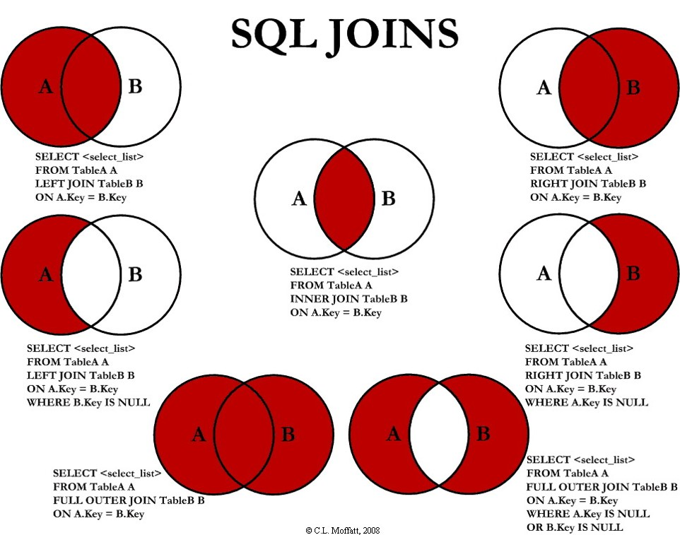

```{r setup, include=FALSE}
options(htmltools.dir.version = FALSE)
knitr::opts_chunk$set(eval=FALSE)
```

# What we covered on Wednesday?

- Data normalization

--

- Table joins


```{r}
SELECT [DISTINCT] <column expression list>
  FROM <table1 [AS t1], ... , tableN [AS tn]> #<<
  [WHERE <predicate>]
[GROUP BY <column list> 
  [HAVING <predicate>] ]
[ORDER BY <column list>];
```


--

**Note:** likely a terribly inefficient strategy! We explore different flavors of **joins** today.
  
---
# Join Variants

```{r}
SELECT <column_list>
FROM  <table_name>
  [INNER | {LEFT |RIGHT | FULL } {OUTER}] JOIN table_name #<<
    ON <qualification_list> #<<
WHERE <conditions>
```

--

- `INNER` is default

- Inner join is akin to what we have seen so far.

- The term `OUTER` is optional for `LEFT, RIGHT,` and `FULL` joins.

  - Example: `LEFT OUTER` = `LEFT`

---
# Inner/Natural Joins

.pull-left[
*Sailor*

| sid | sname | rating | age |
|-----|-------|--------|-----|
| 1 | fred | 7 | 22 |
| 2 | jim | 2 | 39 |
| 3 | nancy | 8 | 27 |

]

.pull-right[
*Boats*

| bid | bname | color |
|-----|-------|--------|
| 101 | nina | red |
| 102 | pinta | blue |
| 103 | santa maria | red |

]


.center[*Reserves*]

| sid | bid | day |
|-----|-------|--------|
| 1 | 102 | 9/12 |
| 2 | 102 | 9/13 |


--

```{r, }
SELECT s.sid, s.sname, r.bid
    FROM Sailors s, Reserves r
   WHERE s.sid = r.sid
     AND s.age > 20;
```


---
# Inner/Natural Joins

```{r, }
SELECT s.sid, s.sname, r.bid
    FROM Sailors s, Reserves r
   WHERE s.sid = r.sid
     AND s.age > 20;
```

--

```{r, }
SELECT s.sid, s.sname, r.bid
  FROM Sailors s INNER JOIN Reserves r #<<
    ON s.sid = r.sid #<<
WHERE s.age > 20;
```

--

```{r, }
SELECT s.sid, s.sname, r.bid
  FROM Sailors s NATURAL JOIN  Reserves r #<<
WHERE s.age > 20;
```

--

"NATURAL" means equi-join for each pair of attributes with the same name.

---
# Left Join

- Returns all matched rows, **and preserves all unmatched rows from the table on the left** of the join clause (use nulls in fields of non-matching tuples)

```{r, }
SELECT s.sid, s.sname, r.bid
  FROM Sailors s LEFT JOIN Reserves r 
    ON s.sid = r.sid 
```

--

Returns all sailors & bid for boat in any of their reservations


**Note:** If there is a sailor without a boat reservation then the sailor is matched with the NULL bid.

---

.pull-left[
*Sailor*

| sid | sname | rating | age |
|-----|-------|--------|-----|
| 1 | fred | 7 | 22 |
| 2 | jim | 2 | 39 |
| 3 | nancy | 8 | 27 |

]

.pull-right[
*Reserves*

| sid | bid | day |
|-----|-------|--------|
| 1 | 102 | 9/12 |
| 2 | 102 | 9/13 |

]

<br>

```{r, }
SELECT s.sid, s.sname, r.bid
  FROM Sailors s LEFT JOIN Reserves r 
    ON s.sid = r.sid 
```

--

| sid | sname | bid |
|-----|-------|--------|
| 1 | fred | 102 |
| 2 | jim | 102 |
| 3 | nancy | **(null)** |

---
# Discussion

.pull-left[

*Boats*

| bid | bname | color |
|-----|-------|--------|
| 101 | nina | red |
| 102 | pinta | blue |
| 103 | santa maria | red |

]

.pull-right[
*Reserves*

| sid | bid | day |
|-----|-------|--------|
| 1 | 102 | 9/12 |
| 2 | 102 | 9/13 |

]

<br>

```{r, }
SELECT b.bid, b.bname, r.sid
  FROM Boat b LEFT JOIN Reserves r 
    ON b.bid = r.bid 
```

<br>

.center[**What is the expected output?**]

---
# Right Join

- Returns all matched rows, **and preserves all unmatched rows from the table on the right** of the join clause (use nulls in fields of non-matching tuples)

```{r, }
SELECT r.sid, b.bid, b.bname
  FROM Reserves r RIGHT JOIN Boats b 
    ON b.bid = r.bid 
```

--

- Returns all boats & information on which ones are reserved

--

- No match for `b.bid`?

--

  - `r.sid` is **NULL**
  
---
# Full Outer Join

- Full Outer Join returns all (matched or unmatched) rows from the tables on both sides of the join clause

--

```{r, }
SELECT r.sid, b.bid, b.bname
  FROM Reserves r RIGHT JOIN Boats b 
    ON b.bid = r.bid 
```

- If no boat for a sailor?

--

  - `b.bid` *IS NULL* **AND** `b.bname` *IS NULL*
  
--

- If no sailor for a boat?

--

  - `r.sid` *IS NULL*
  
---
.pull-left[
*Boats*

| bid | bname | color |
|-----|-------|--------|
| 101 | nina | red |
| 102 | pinta | blue |
| 103 | santa maria | red |

]

.pull-right[
*Reserves*

| sid | bid | day |
|-----|-------|--------|
| 1 | 102 | 9/12 |
| 2 | 102 | 9/13 |
| 3 | 104 | 9/15 |

]

<br>

```{r, }
SELECT r.sid, b.bid, b.bname
  FROM Reserves r FULL JOIN Boats b
    ON b.sid = r.sid 
```

--

.center[*Result*]

| sid | bid | bname |
|-----|-------|--------|
| 1 | 102 | pinta |
| 2 | 102 | pinta |
| 3 | **(null)** | **(null)** |
| **(null)** | 101 | nina |
| **(null)** | 103 | santa maria |

---
# Brief Detour: `NULL` Values

- Field values are sometimes **unknown**

  - SQL provides a special value `NULL` for such situations.
  
  - Every data type can be `NULL`

--

- The presence of null complicates many issues. E.g.:

  - Selection conditions (`WHERE`)
  
  - Aggregation
  
--

- But `NULLs` are common after outer joins

---
# `NULL` in the `WHERE` clause


- Consider a tuple where `rating` IS NULL.

```{r}
INSERT INTO sailors VALUES
  (11, 'Jack Sparrow', NULL, 35);
```

--

- If we run the following query

```{r}
SELECT * FROM sailors
WHERE rating > 8;
```

- Jack Sparrow will not be included in the output.

---
# `NULL` in comparators

- What entries are in the output of the query?

```{r}
SELECT * FROM sailors WHERE rating = NULL;
```

--

- **Rule:** `(x <op> NULL)` evaluates to ... NULL!

--

- To check if a value is `NULL`, you must use explicit NULL check

```{r}
SELECT * FROM sailors WHERE rating IS NULL;
SELECT * FROM sailors WHERE rating IS NOT NULL;
```

---
# NULL in Boolean Logic



--

| sid | sname | rating | age |
|-----|-------|--------|-----|
| 1 | fred | 7 | 22 |
| 2 | jim | 2 | 39 |
| 3 | nancy | 8 | 27 |
| 11 | jack | **(null)** | 35 |

```{r}
SELECT * FROM sailors WHERE rating > 8 AND TRUE;
SELECT * FROM sailors WHERE rating > 8 OR TRUE;
SELECT * FROM sailors WHERE NOT (rating > 8);
```

---
# NULL and Aggregation

.pull-left[

```
SELECT count(rating) FROM sailors;

SELECT sum(rating) FROM sailors;

SELECT avg(rating) FROM sailors;

SELECT count(*) FROM sailors;

```
]

.pull-right[

| sid | sname | rating | age |
|-----|-------|--------|-----|
| 1 | fred | 7 | 22 |
| 2 | jim | 2 | 39 |
| 3 | nancy | 8 | 27 |
| 11 | jack | **(null)** | 35 |

]

<br>

.center[What are the expected output for these queries?]

---
class: center, middle


