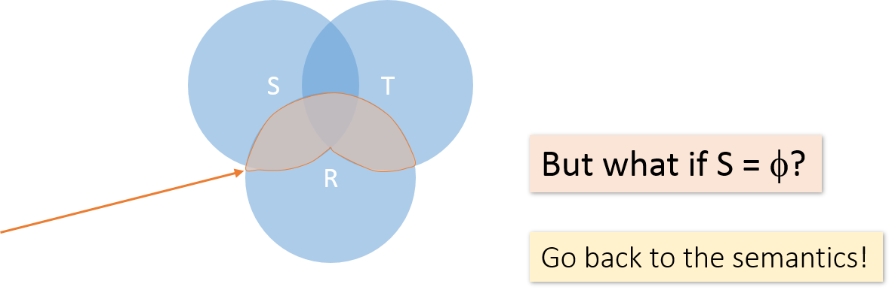

```{r setup, include=FALSE}
options(htmltools.dir.version = FALSE)
knitr::opts_chunk$set(eval=FALSE)
```

# What we covered on Friday?

--

- Table joins


```{r}
SELECT <column_list>
FROM  <table_name>
  [INNER | {LEFT |RIGHT | FULL } {OUTER}] JOIN table_name #<<
    ON <qualification_list> #<<
WHERE <conditions>
```

--

- `NULL` value

  - Three-value Boolean logic
  
  - Aggregate function with `NULL` value
  
---
# An unituitive Query

- In the lab, we wrote a query:

```{r}
SELECT DISTINCT R.A
FROM R, S, T
WHERE R.A = S.A OR R.A = T.A;
```

--



---
# An unituitive Query

- In the lab, we wrote a query:

```{r}
SELECT DISTINCT R.A
FROM R, S, T
WHERE R.A = S.A OR R.A = T.A;
```

<br>

- Recall the semantics

  1. Take *cross-product*
  2. Apply *selection* / conditions (filter rows)
  3. Apply *projection* (filter columns)

--

- If $S$ is empty, then the cross-product of $R, S, T$ is empty. Hence the query gives out empty result.

---
# Set Operations in SQL

- **Joins** combine data into new columns. 

```{r, out.width='50%', fig.align='center', echo=FALSE, eval=TRUE}
knitr::include_graphics('images/visual-joins.png')
```


--

- Set operations in SQL combine data into new rows. For example: the `UNION`

```{r, out.width='50%', fig.align='center', echo=FALSE, eval=TRUE}
knitr::include_graphics('images/visual-union.png')
```

---
# Set operations in SQL

.pull-left[

```{r}
SELECT R.A
FROM   R, S
WHERE  R.A=S.A
INTERSECT #<<
SELECT R.A
FROM   R, T
WHERE  R.A=T.A
```


]

.pull-right[

```{r}
SELECT R.A
FROM   R, S
WHERE  R.A=S.A
UNION #<<
SELECT R.A
FROM   R, T
WHERE  R.A=T.A
```


]

[http://sqlfiddle.com/#!7/b4325](http://sqlfiddle.com/#!7/b4325)
---
# Notes on set operations in SQL

- Requirements:

  1. Number of columns must be the same for both tables.

  2. The columns, in order, must be of the same data types.

--

- UNION: After combining rows, it performs an `DISTINCT` operation to remove all duplicates.

--

- To keep all duplicates, use `UNION ALL` instead of `UNION`.

```{r}
SELECT R.A
FROM   R, S
WHERE  R.A=S.A
UNION ALL #<<
SELECT R.A
FROM   R, T
WHERE  R.A=T.A
```

---
# Discussion


```{r}
Company (name, hq_city)
Product (pname, maker, factory_loc)
```

<br>

.pull-left[
```{r}
SELECT hq_city
FROM Company, Product
WHERE maker = name
  AND factory_loc = 'US'
INTERSECT #<<
SELECT hq_city
FROM Company, Product
WHERE maker = name
  AND factory_loc = 'China'
```

]

.pull-right[
.middle[
"Headquarters of companies which make products in both US **AND** China"]

]
<br>

--

**What if two companies have HQ in US, but one has factory in China (but not US) and vice versa? *What goes wrong?* **

---
# Here is a scenario


```{r}
Company (name, hq_city) AS C
Product (pname, maker, factory_loc) AS P
```


```{r}
SELECT hq_city
FROM Company, Product
WHERE maker = name AND factory_loc = 'US'
INTERSECT #<<
SELECT hq_city
FROM Company, Product
WHERE maker = name AND factory_loc = 'China'
```


*Example:* `C JOIN P on maker = name`

| C.name | C.hq_city | P.pname | P.maker | P.factory_loc |
|--------|-----------|---------|---------|---------------|
| X Co. | Evansville | X | X Co. | US |
| Y Inc. | Evansville | Y  | Y Inc. | China |


---
# One Solution : Nested Queries

```{r}
Company (name, hq_city)
Product (pname, maker, factory_loc)
```

```{r}
SELECT DISTINCT hq_city
FROM   Company, Product
WHERE  maker = name 
       AND name IN (
		SELECT maker
	  	FROM   Product
	  	WHERE  factory_loc = ‘US’)
	 AND name IN (
		SELECT maker
	  	FROM   Product
	  	WHERE  factory_loc = ‘China’)
```

--

**Question:** What if we hadn't used `DISTINCT` here?

---
# Nested queries: Subqueries Return Relations

Another example:
```{r}
Company (name, city) 
Product (pname, maker)
Purchases (id, product, buyer)
```

--

.pull-left[

```{r}
SELECT c.city
FROM   Company c
WHERE  c.name  IN (
	SELECT pr.maker
  FROM Purchase p, Product pr
  WHERE  p.product = pr.name 
	  AND p.buyer = ‘Joe Blow‘)
```

]

--

.pull-right[
"Cities where one can find companies that manufacture products bought by Joe Blow"
]

---
# Nested Queries - Are there queries equivalent?

.pull-left[

```{r}
SELECT c.city
FROM   Company c
WHERE  c.name  IN (
	SELECT pr.maker
  FROM Purchase p, Product pr
  WHERE  p.product = pr.name 
	  AND p.buyer = ‘Joe Blow‘)
```

]

.pull-right[

```{r}
SELECT c.city
 FROM   Company c, 
        Product pr, 
        Purchase p
 WHERE  c.name = pr.maker
   AND  pr.name = p.product
   AND  p.buyer = ‘Joe Blow’
```
]

--

<br>

.center[**Beware of duplicates!**]
---
# Nested Queries

.pull-left[

```{r}
SELECT DISTINCT c.city
FROM   Company c
WHERE  c.name  IN (
	SELECT pr.maker
  FROM Purchase p, Product pr
  WHERE  p.product = pr.name 
	  AND p.buyer = ‘Joe Blow‘)
```

]

--

.pull-right[

```{r}
SELECT DISTINCT c.city
 FROM   Company c, 
        Product pr, 
        Purchase p
 WHERE  c.name = pr.maker
   AND  pr.name = p.product
   AND  p.buyer = ‘Joe Blow’
```
]

--

<br>

.center[*Queries are now equivalent*]
---
# Subqueries Return Relations

You can also use operations of the form:

- `s > ALL R`

- `s < ANY R`

- `EXISTS R`

--

Unfortunately, `ANY` and `ALL` not supported by SQLite

--

Example: `Product(name, price, category, maker)`

```{r}
SELECT name
FROM   Product
WHERE  price > ALL( #<<
	SELECT price
     FROM   Product
     WHERE  maker = ‘Gizmo-Works’);
```

---
# Subqueries Return Relations

You can also use operations of the form:

- `s > ALL R`

- `s < ANY R`

- `EXISTS R`

--

Example: `Product(name, price, category, maker)`

```{r}
SELECT p1.name
FROM   Product p1
WHERE  p1.maker = ‘Gizmo-Works’
   AND EXISTS( #<<
	SELECT p2.name
      FROM   Product p2
      WHERE  p2.maker <> ‘Gizmo-Works’
	   AND p1.name = p2.name)
```

---
# Nested queries as alternatives to `INTERSECT`

- *Note:* `INTERSECT` might **not** be available in some DBMSs!

```{r}
(SELECT R.A, R.B
 FROM   R)
INTERSECT
(SELECT S.A, S.B
 FROM   S)
```

--

```{r}
SELECT R.A, R.B
FROM   R
WHERE EXISTS(
   	SELECT *
   	  FROM S
   	WHERE R.A=S.A AND R.B=S.B)
```

--

**Question:** If R, S have no duplicates, then can write without sub-queries (HOW?)

---
# Correlated Queries
### Using External Vars in Internal Subquery

> Find movies whose title appears more than once.

```{r}
Movie(title, year, director, length)
```

--

```{r}
SELECT DISTINCT title
FROM   Movie AS m #<<
WHERE  year <> ANY( 
		SELECT  year
     	FROM    Movie  #<<
     	WHERE  title =  m.title) #<<
```

- *Note:* the scoping of the variables!

---
# Complex Correlated Query

> Find products (and their manufacturers) that are more expensive than all products made by the same manufacturer before 1972

```{r}
Movie(title, year, director, length)
```

<br>

.center[ **Let's pause and attempt to write such query**]

--

<br>

```{r}
SELECT DISTINCT  x.name, x.maker
FROM   Product AS x
WHERE  x.price > ALL(
		SELECT y.price
          FROM   Product AS y
          WHERE  x.maker = y.maker 
		   AND y.year < 1972)
```

**Note:** Complex correlated query can be very powerful (also much harder to optimize)

---
# Nested Query vs. `GROUP BY`

```{r}
Author (login, name)
Wrote (login, url)
```

> Find authors who wrote 10 or more documents.

--

*Attempt 1: with nested queries*

```{r}
SELECT DISTINCT Author.name
FROM   Author
WHERE  COUNT(
	SELECT Wrote.url
	FROM   Wrote
	WHERE  Author.login = Wrote.login) > 10
```

---
# Nested Query vs. `GROUP BY`

```{r}
Author (login, name)
Wrote (login, url)
```

> Find authors who wrote 10 or more documents.

--

*Attempt 2: without nested queries*

--

```{r}
SELECT   Author.name
FROM     Author, Wrote
WHERE    Author.login = Wrote.login
GROUP BY Author.name
HAVING   COUNT(Wrote.url) > 10
```

**Question:** Do we need `DISTINCT` in the above query?

---
# Nested Query vs. `GROUP BY`

Which way is more efficient?

--

- Attempt 1 - with nested queries: How many times do we do a SFW query over all of the Wrote relations?

--

- Attempt 2 - with `GROUP BY`: How about when written this way?

--

.center[With `GROUP BY`, queries can be much more efficient!]
